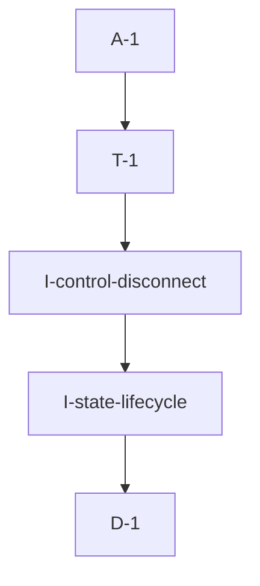

# Pipeline Plan

Risk profile: ./risk-profile.yaml

## Trigger
- Proposal: docs/versions/v0.1/modules/bucky-vpn-server/026-recover-pn-observed-address/proposal.md
- User launch confirmed: yes
- User launch statement: `确认，自动完成`
- Launch stage: proposal
- First auto stage: design
- Design source: pipeline/plan.md
- Per-stage user confirmation: skipped by explicit user auto-pipeline authorization
- Auto-confirm completed document stages: no design/testing Markdown documents generated; acceptance report is validated at completion
- Auto-pipeline document policy: stage-selective; no automatic design/testing Markdown; testplan.yaml required for automatic testing
- Version: v0.1
- Packet module: bucky-vpn-server
- Task name: 026-recover-pn-observed-address
- Target module(s): bucky-vpn-server
- change_id values: CHG-recover-pn-observed-address

## Acceptance Baseline
- Final acceptance is judged against the launch-confirmed `proposal.md` and this automatic-design mapping.

## Stage Graph
| Task ID | Stage | Execution Mode | Responsibility | Scope | Parent Task | Depends On | Output | Done Condition |
|---------|-------|----------------|----------------|-------|-------------|------------|--------|----------------|
| D-1 | design | auto-pipeline | map PN control-session observation ownership, heartbeat liveness, selection, disconnect, and recovery boundaries | bound bucky-vpn-server task packet | root | none | complete pipeline-plan mappings and risk checks | plan, scope bindings, state ownership, failure flows, and risk profile validate without design.md |
| I-state-lifecycle | implementation | auto-pipeline | preserve a control-supported observation across heartbeat timeout and restore selectable state on cmd158 recovery | PN server manager lifecycle | root | D-1 | updated pn_server_manager.rs | timeout no longer destroys a live-session observation; heartbeat recovery recomputes the endpoint and logs one transition |
| I-control-disconnect | implementation | auto-pipeline | bind final peer disconnect to observation cleanup while retaining accept-time observation | PN control command server | root | I-state-lifecycle | updated pn_control_server.rs | last command connection disconnect clears only its matching observation generation; a concurrently accepted newer connection observes and retains its current remote address |
| T-1 | testing | auto-pipeline | derive and run task-scoped timeout recovery, disconnect, repeated-cycle, address-change, compatibility, and compile verification | delivered bucky-vpn-server code | root | I-control-disconnect | testplan.yaml, dedicated tests, runtime coverage, and test-run artifact | the change id and every applicable risk check have passing evidence or a concrete platform gap |
| A-1 | acceptance | auto-pipeline | falsify proposal, design, lifecycle, security, logging, and validation claims and close or return defects | complete delivery | root | T-1 | acceptance-report.md and final runtime state | report is accepted and pipeline exit checks pass |

## Submodule Tasks
| Task ID | Stage | Execution Mode | Responsibility | Submodule | Parent Task | Depends On | Output | Done Condition |
|---------|-------|----------------|----------------|-----------|-------------|------------|--------|----------------|

No deeper submodule tasks are created. The manager owns remote PN lifecycle and the control server owns transport-session events; the two dependent file-level implementation tasks already express those boundaries, so another nesting layer would duplicate ownership.

## Parallel Scheduling
- Strategy: dependency-ready-set
- Concurrency: use runtime-available child-agent slots when dependencies permit; this task's dependency graph keeps the production edit tasks serial.
- Shared artifact owner: parent-orchestrator
- Coordination: practical edit coordination implements the state-manager contract before the command-server event binding that consumes it; at each scheduling point, available capacity is considered for dependency-ready work.
- Lock directory: `.harness/locks/`
- Serialization reasons: explicit dependency, edit coordination, or exhausted concurrency capacity only.
- Evidence: automatic task launches are recorded under `.harness/pipelines/v0.1/bucky-vpn-server/026-recover-pn-observed-address/state.json`.

## Dependency Graphs


Arrows point from each dependent task to its prerequisite.

| Level | Parent | Node | Depends On |
|-------|--------|------|------------|
| pipeline-task | root | D-1 | none |
| pipeline-task | root | I-state-lifecycle | D-1 |
| pipeline-task | root | I-control-disconnect | I-state-lifecycle |
| pipeline-task | root | T-1 | I-control-disconnect |
| pipeline-task | root | A-1 | T-1 |

## Exported Interfaces
| Interface | Owner | Consumer | Compatibility | Affected Callers | Migration Path |
|-----------|-------|----------|---------------|------------------|----------------|
| new crate-local observation-generation and remote-control disconnect notification | `PnServerManager` | `vpn-server/src/pn_control_server.rs` | new | none | command-service peer-disconnect listener snapshots the current observation generation, verifies the peer still has no command tunnel, and conditionally clears only that generation |
| existing `PnServerSelector` heartbeat and selection behavior | `PnServerManager` | vpn-frame cmd158 handler and VPN client information service | backward-compatible | none | retain the shared trait and wire payload; refine only internal lifecycle state |

## File-Level Interfaces
```rust
impl PnServerManager {
    pub(crate) fn control_observation_id(&self, id: &NodeId) -> Option<u64>;
    pub(crate) fn report_control_disconnected(&self, id: &NodeId, expected_observation_id: u64);
}

impl CmdServerEventListener for PnControlConnectionListener {
    async fn on_peer_disconnected(&self, peer_id: &PeerId);
}
```

The disconnect notification is local to `bucky-vpn-server`; it adds no exported crate-root symbol or protocol field.

## API and Build Surface Impact
- Public API impact: backward-compatible
- Crate-root export change: no
- Build-surface change: no
- Documentation examples affected: no
- Impact detail: cmd158 encoding, shared traits, VPN client response structures, dependencies, Cargo features, and configuration remain unchanged.

## State Ownership
| State | Owner | Access Interface | Lifecycle | Failure Transitions |
|-------|-------|------------------|-----------|---------------------|
| cmd158 reported protocols, mapped ports, optional advertised IP, and last heartbeat | `RemotePnServerState` in `PnServerManager` | `report_heartbeat` | created/updated by cmd158; liveness expires at remote TTL; retained only as needed to merge with a session observation | timeout produces one offline transition and makes selection fail; a later heartbeat resets the transition and recomputes current state |
| observed public IP, monotonic observation generation, and control-session presence | `RemotePnServerState` in `PnServerManager`, driven by command service | registered-command-tunnel observation plus final-peer-disconnect notification | command tunnel is registered before its remote address is observed; observation gets a process-local generation; it is retained across heartbeat timeout and cleared only when the final peer connection is absent and the generation still matches | disconnect removes trust in the matching old address; a late disconnect callback cannot erase a newer reconnect observation; a new accept records the new address and generation |
| merged current PN endpoints and selectable view | `PnServerManager` | state merge, approval, heartbeat liveness, and endpoint filtering | recomputed after report, observation, timeout transition, or disconnect | no live heartbeat or no connectable endpoint means the PN is excluded from `pn_proxy_nodes` and client selection |
| offline-transition logging state | `RemotePnServerState` | pruning and heartbeat/observation updates | set once when a live heartbeat crosses TTL; cleared on recovered heartbeat | repeated prune cycles cannot repeat the same offline log; each new live-to-offline cycle can log once |

## Key Call Flows
```mermaid
sequenceDiagram
  participant PN as Standalone PN
  participant Cmd as PN control command server
  participant Manager as PnServerManager
  participant Client as VPN client info service

  PN->>Cmd: establish authenticated control connection
  Cmd->>Manager: observe remote_ep public IP
  PN->>Cmd: cmd158 protocols and mapped ports
  Cmd->>Manager: report heartbeat
  Manager->>Manager: merge observed IP and mapped port
  Client->>Manager: select live proxy nodes
  Manager-->>Client: connectable PN endpoint
  Note over Manager: heartbeat crosses TTL; log offline once but retain session observation
  PN->>Cmd: later cmd158 on same connection
  Cmd->>Manager: report recovered heartbeat
  Manager->>Manager: merge retained observed IP and mapped port
  Manager-->>Client: PN selectable again
```

## Failure Flows
| Flow | Boundary | Failure | Handling |
|------|----------|---------|----------|
| heartbeat expires while control connection remains | pruning to remote state | PN is temporarily offline | log one offline transition, keep the observed IP, exclude by heartbeat liveness, and allow later cmd158 to recover without a new accept |
| final control connection closes | command service to manager | observed address loses session support | clear observation immediately, recompute reported-only state, and exclude an addressless PN even if its last heartbeat is fresh |
| PN reconnects through a changed NAT address | accept callback to manager | previous public address is stale | observe the new `remote_ep`, merge with the latest report, and emit address-change logging only when the usable endpoint changes |
| PN reports no local address | cmd158 to merge | report contains protocols and mapped ports but no IP | construct endpoints only when a live-session observation supplies a non-unspecified IP; otherwise remain unselectable |
| duplicate/multiple peer connections | command service peer manager | one of several connections closes | use the service's last-peer-disconnect event so the observation is not cleared prematurely |
| disconnect callback overlaps fast reconnect | command service, connection registry, and manager generation guard | the old callback can run after a new address was observed | register the new tunnel before observation, recheck current tunnels, and clear only the observation generation captured by the disconnect path |

## Invariants to Preserve
- Heartbeat liveness and control-session address observation have independent lifetimes.
- No old observed address remains trusted after the final control connection disconnects.
- A stale disconnect callback cannot clear an observation written by a newer accepted connection, even when disconnect and reconnect execute on different runtime workers.
- A PN is selectable only when approved, heartbeat-live, and represented by at least one connectable endpoint.
- Recovered online logging describes a usable merged state, not merely receipt of cmd158.
- Existing protocol, approval, traffic accounting, mapped-port, and client version/incremental-list behavior remain unchanged.

## Rejected Alternatives
| Decision Type | Selected | Rejected | Reason |
|---------------|----------|----------|--------|
| boundary | keep observation for the lifetime of the command peer and heartbeat for the TTL lifetime | erase the whole PN state at heartbeat timeout | erasure loses the only public IP for `report_local_address: false` even though the same authenticated session still exists |
| technical | consume the command service's final-peer-disconnect callback | clear observation whenever any accepted stream ends | one PN may have multiple command connections, so per-stream cleanup can prematurely remove a still-supported observation |
| technical | recover from the retained accept-time `remote_ep` | infer public IP from cmd158 or require `advertised_ip` | cmd158 intentionally omits the external IP in this deployment and cannot prove NAT-observed reachability |
| technical | clear observation on final disconnect and reobserve on new accept | retain an observation indefinitely across transport disconnects | indefinite retention could publish a stale NAT binding or address belonging to a later session |
| technical | register the command tunnel before recording its address and guard cleanup with a monotonic observation generation | clear the manager state unconditionally from a delayed peer-disconnect callback | callback delivery occurs after connection-registry removal and can overlap a fast reconnect, so unconditional cleanup can erase the newer session |
| collaboration | implement manager lifecycle before its control-server consumer | edit both dependent files concurrently | the disconnect listener must consume a stable manager contract and the files form one ordered lifecycle change |

## Implementation Scope Bindings
| change_id | target_module | proposal_id | design_coverage | scope_paths | design_rules_applied |
|-----------|---------------|-------------|-----------------|-------------|----------------------|
| CHG-recover-pn-observed-address | bucky-vpn-server | P-001 | separate observation and heartbeat lifetimes, recover mapped endpoints on the same session, clear the observation on final disconnect, and preserve selection/logging invariants | `vpn-server/src/pn_server_manager.rs`, `vpn-server/src/pn_control_server.rs`, `vpn-server/tests/**` | state ownership, runtime/security failure flow, backward compatibility, transport lifecycle, merge ordering |

## File-Level Implementation Sequence
| Sequence | Task ID | File-Level Module | Action | Depends On | change_id | target_module | Scope Paths | Context Sources |
|----------|---------|-------------------|--------|------------|-----------|---------------|-------------|-----------------|
| 1 | I-state-lifecycle | `vpn-server/src/pn_server_manager.rs` | preserve a live-session observation across TTL, track one offline transition, recover merged endpoints on heartbeat, and expose final-disconnect cleanup | none | CHG-recover-pn-observed-address | bucky-vpn-server | `vpn-server/src/pn_server_manager.rs` | proposal P-001, remote TTL pruning, reported/observed merge, selection predicate |
| 2 | I-control-disconnect | `vpn-server/src/pn_control_server.rs` | register each accepted command tunnel before observation, attach a final-peer listener that rechecks the registry, and conditionally clears the captured observation generation | I-state-lifecycle | CHG-recover-pn-observed-address | bucky-vpn-server | `vpn-server/src/pn_control_server.rs` | proposal P-001, remote_ep observation, command peer-manager events, disconnect/reconnect callback ordering |

## Return Rules
- Proposal ambiguity or an incorrect acceptance boundary stops the pipeline for user decision.
- Incorrect state ownership, disconnect lifetime, compatibility, or selection semantics returns to D-1.
- Lost observations, stale observations after final disconnect, repeated transition logs, missing endpoint recovery, or compile failures return to the owning implementation task.
- Missing timeout, recovery, disconnect, repeated-cycle, address-change, compatibility, or compile evidence returns to T-1.
- The same unresolved issue stops after more than five unsuccessful return iterations.

## Exit Conditions
- A `report_local_address: false` PN that crosses heartbeat TTL but keeps its control connection becomes selectable again after cmd158 resumes, using the observed public IP and mapped port.
- The same offline transition logs once, recovery logs once, and repeated cycles remain correct.
- Final peer disconnect clears the observation; a new connection reobserves and can replace the public address.
- A delayed disconnect notification for an older connection generation cannot clear a newer reconnect observation.
- No addressless, heartbeat-stale, unapproved, or otherwise unconnectable PN is returned to clients.
- Focused regression tests and affected-target compile closure pass without a wire, dependency, or public API change.
- Final acceptance report is accepted with no blocking findings.
