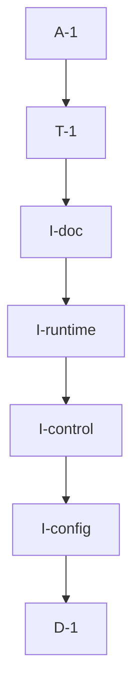

# Pipeline Plan

Risk profile: ./risk-profile.yaml

## Trigger
- Proposal: docs/versions/v0.1/modules/bucky-vpn-server/031-pn-tcp-only-transport/proposal.md
- User launch confirmed: yes
- User launch statement: `确认，自动完成`
- Launch stage: proposal
- First auto stage: design
- Design source: pipeline/plan.md
- Per-stage user confirmation: skipped by explicit user auto-pipeline authorization
- Auto-confirm completed document stages: no design/testing Markdown documents generated; acceptance report is validated at completion
- Auto-pipeline document policy: stage-selective; no automatic design/testing Markdown; testplan.yaml required for automatic testing
- Version: v0.1
- Packet module: bucky-vpn-server
- Task name: 031-pn-tcp-only-transport
- Target module(s): bucky-vpn-server
- change_id values: CHG-enable-standalone-pn-transport-modes

## Acceptance Baseline
- Final acceptance is judged against the launch-confirmed `proposal.md` and this automatic-design mapping.

## Stage Graph
| Task ID | Stage | Execution Mode | Responsibility | Scope | Parent Task | Depends On | Output | Done Condition |
|---------|-------|----------------|----------------|-------|-------------|------------|--------|----------------|
| D-1 | design | auto-pipeline | map three-mode configuration, endpoint construction, control fallback, compatibility, and failure boundaries | bound bucky-vpn-server task packet | root | none | complete pipeline-plan mappings and risk checks | plan, interfaces, state ownership, failure flows, scope bindings, and risk profile validate without design.md |
| I-config | implementation | auto-pipeline | parse and validate tcp, quic, and dual modes; derive protocol-specific endpoint candidates and filtered report port mappings | vpn-server configuration boundary | root | D-1 | updated server_config.rs | three modes and default produce exact standalone-PN listener/control/report endpoint sets; invalid and combined-mode configurations fail clearly; SN-only behavior is unaffected |
| I-control | implementation | auto-pipeline | connect the standalone PN control tunnel through ordered protocol candidates and transfer maintained-target ownership on reconnect | PN control client transport factory | root | I-config | updated pn_control_client.rs | single modes use one target; unclassified dual creation tries QUIC then TCP; classified recreation honors its exact configured route; at most one target remains maintained and one command tunnel is returned |
| I-runtime | implementation | auto-pipeline | wire the resolved service endpoints, their actual primary endpoint, and transport-filtered report mapping into server identity, listeners, route hint, and PN reporting | server startup assembly | root | I-control | updated main.rs | standalone runtime behavior matches the selected mode while combined and SN-only runtime behavior remains compatible |
| I-doc | implementation | auto-pipeline | document the three transport values, default, restriction, and environment override | server example YAML | root | I-runtime | updated config.example.yaml | documented configuration matches the implemented runtime contract |
| T-1 | testing | auto-pipeline | derive and run configuration, endpoint, fallback, compatibility, failure, and compile verification | delivered bucky-vpn-server code | root | I-doc | testplan.yaml, focused tests, runtime coverage, and task-run artifact | the change id and every applicable risk check have passing evidence or a concrete environment gap |
| A-1 | acceptance | auto-pipeline | independently falsify requirement, design, runtime, compatibility, resource, and test claims and close or return defects | complete delivery | root | T-1 | acceptance-report.md and final runtime state | report is accepted and pipeline exit checks pass |

## Submodule Tasks
| Task ID | Stage | Execution Mode | Responsibility | Submodule | Parent Task | Depends On | Output | Done Condition |
|---------|-------|----------------|----------------|-----------|-------------|------------|--------|----------------|

No deeper submodule tasks are created. The requested feature is one transport-selection responsibility whose configuration, connection, and startup files form a short dependency chain; splitting nested tasks would duplicate ownership.

## Parallel Scheduling
- Strategy: dependency-ready-set
- Concurrency: use runtime-available child-agent slots when dependencies permit; this task's file-level dependency graph keeps automatic work serial.
- Shared artifact owner: parent-orchestrator
- Coordination: practical edit coordination completes configuration semantics before control-client fallback and startup wiring; available capacity is reconsidered at every dependency-ready scheduling point, while test metadata and runtime state remain parent-coordinated shared artifacts.
- Lock directory: `.harness/locks/`
- Serialization reasons: explicit dependency, edit coordination, or exhausted concurrency capacity only.
- Evidence: automatic task launches are recorded under `.harness/pipelines/v0.1/bucky-vpn-server/031-pn-tcp-only-transport/state.json`.

## Dependency Graphs


Arrows point from each dependent task to its prerequisite.

| Level | Parent | Node | Depends On |
|-------|--------|------|------------|
| pipeline-task | root | D-1 | none |
| pipeline-task | root | I-config | D-1 |
| pipeline-task | root | I-control | I-config |
| pipeline-task | root | I-runtime | I-control |
| pipeline-task | root | I-doc | I-runtime |
| pipeline-task | root | T-1 | I-doc |
| pipeline-task | root | A-1 | T-1 |

## Exported Interfaces
| Interface | Owner | Consumer | Compatibility | Affected Callers | Migration Path |
|-----------|-------|----------|---------------|------------------|----------------|
| `pn.transport` values `tcp`, `quic`, and `dual` | `vpn-server/src/server_config.rs` | server operators and `vpn-server/src/main.rs` | backward-compatible | existing config files without the key | omission maps to `dual`, preserving the current QUIC plus TCP behavior |
| ordered control endpoint candidates | `PnControlServerConfig` | `ControlCmdTunnelFactory` in `vpn-server/src/pn_control_client.rs` | migration-required | `vpn-server/src/main.rs`, `vpn-server/src/pn_control_client.rs`, existing server tests | keep the operator's single socket-address `pn.control_server.endpoint`, derive one or two protocol candidates from `pn.transport`, and replace internal single-`endpoint` consumers; no external crate API or wire migration |
| mode-aware service endpoint resolution | `resolve_service_endpoints` and `PnTransportMode` in `vpn-server/src/server_config.rs` | `vpn-server/src/main.rs` identity, listener, and PN reporting assembly | backward-compatible | `vpn-server/src/main.rs`, existing server configuration tests | use the selected mode only for standalone PN; keep the current QUIC-plus-TCP set for SN-only or accepted combined deployments, and select the first resolved endpoint as the report primary |
| transport-filtered PN report mapping | `PnTransportMode` in `vpn-server/src/server_config.rs` | `vpn-server/src/main.rs` PN payload construction | new | current change id | copy only enabled protocol fields from the existing `PnPortMappingConfig` into the reported mapping; do not mutate operator configuration or the wire type |

## File-Level Interfaces
```rust
#[derive(Clone, Copy, Debug, Eq, PartialEq)]
pub enum PnTransportMode {
    Tcp,
    Quic,
    Dual,
}

impl PnTransportMode {
    pub fn endpoints(self, addr: SocketAddr) -> Vec<P2pEndpoint>;
    pub fn filter_port_mapping(self, mapping: &PnPortMappingConfig) -> PnPortMappingConfig;
}

pub struct PnServerConfig {
    pub transport: PnTransportMode,
    // existing fields remain unchanged
}

pub struct PnControlServerConfig {
    pub endpoints: Vec<P2pEndpoint>,
    // existing identity fields remain unchanged
}

pub struct ControlCmdTunnelFactory {
    // existing TTP client and control identity fields remain unchanged
    control_endpoints: Vec<P2pEndpoint>,
    active_target: Mutex<Option<TtpTarget>>,
}
```

`PnTransportMode` is owned by the server configuration module and consumed by service-endpoint resolution plus PN report construction. `PnControlServerConfig.endpoints` is an internal migration from the existing single endpoint: the configured value remains one socket address, while parsing derives `tcp`, `quic`, or ordered `[quic, tcp]` endpoints. `ControlCmdTunnelFactory.active_target` owns only maintained-target selection, not command-client heartbeat state. The concrete field and helper names may follow local style, but conditional standalone selection, candidate ordering, exact classified-route behavior, cleanup, and ownership transfer are fixed.

## API and Build Surface Impact
- Public API impact: backward-compatible
- Crate-root export change: no
- Build-surface change: no
- Documentation examples affected: yes
- Impact detail: the operator-facing YAML accepts one optional key with a compatible default; internal server structs change but are not exported by a library crate; no dependency, feature, wire encoding, CLI, or package surface changes.

## Consumer Migration Closure
| Old Symbol | New Path | change_id | Consumer Path | Consumer Kind | Migration Status |
|------------|----------|-----------|---------------|---------------|------------------|
| `PnControlServerConfig.endpoint` | `PnControlServerConfig.endpoints` | CHG-enable-standalone-pn-transport-modes | vpn-server/src/main.rs | production | migrated |
| `PnControlServerConfig.endpoint` | `PnControlServerConfig.endpoints` | CHG-enable-standalone-pn-transport-modes | vpn-server/src/pn_control_client.rs | production | migrated |
| `PnControlServerConfig.endpoint` | `PnControlServerConfig.endpoints` | CHG-enable-standalone-pn-transport-modes | vpn-server/src/server_config.rs | tests and construction | migrated |

## State Ownership
| State | Owner | Access Interface | Lifecycle | Failure Transitions |
|-------|-------|------------------|-----------|---------------------|
| parsed PN transport mode | immutable `PnServerConfig` | startup configuration read | created once before runtime construction and retained for process lifetime | missing maps to dual; malformed values fail startup before any listener is created; when PN is disabled the value cannot alter an enabled SN listener |
| resolved local endpoints, report primary, and filtered port mapping | startup assembly from `resolve_service_endpoints` / `PnTransportMode` | identity, listener, and `PnServerInfo` construction | derived once after mode validation; first resolved endpoint is the primary and the same set drives listening and reporting | standalone PN uses the selected mode; SN-only remains dual; accepted combined mode is dual; disabled-protocol mapping fields are absent from the payload |
| ordered control endpoint candidates | immutable `PnControlServerConfig` | `ControlCmdTunnelFactory` candidate selection | derived from the configured socket address at config load; reused for each command-tunnel creation/reconnect | unclassified creation iterates configured order; classified creation accepts only its matching configured remote endpoint and a protocol-compatible local endpoint |
| maintained control target | `ControlCmdTunnelFactory.active_target` plus `TtpClient` target registration | private candidate-attempt/commit helpers | absent -> candidate connected -> control stream opened -> committed; on a later successful route, ownership transfers and the previous different target is removed | connect failure registers nothing; stream-open failure calls `remove_server` for that candidate and clears matching ownership; exhausting candidates leaves no newly retained target |
| active PN command tunnel and heartbeat chain | existing single-worker `VpnControlClient` command client and one `PnTrafficService` reporter | classified tunnel factory returns one completed stream | exactly one completed command tunnel is returned, reused, or recreated by the existing client lifecycle; reporter creation remains once-only in startup | sequential fallback stops at first complete stream; failed attempts never create a second reporter or returned command tunnel |

## Key Call Flows
```mermaid
sequenceDiagram
  participant Config as server_config
  participant Main as main startup
  participant Env as P2P environment
  participant Control as control client factory
  participant SN as control node

  Config->>Config: parse pn.transport (default dual)
  Config-->>Main: mode, ordered control endpoints, and mapping config
  Main->>Main: validate mode; resolve service endpoints and actual primary
  Main->>Env: create identity and listen on resolved local endpoints
  Main->>Control: create client with selected control candidates
  loop candidates in mode order
    Control->>SN: connect target and open control stream
    alt candidate succeeds
      SN-->>Control: authenticated stream
      Control->>Control: commit target and remove previous different target
      Control-->>Main: one effective control client
    else candidate fails
      Control->>Control: remove failed maintained target and try next candidate
    end
  end
  Main->>SN: report resolved endpoints and only their mapped ports
```

## Failure Flows
| Flow | Boundary | Failure | Handling |
|------|----------|---------|----------|
| configuration parsing | YAML/environment to `PnTransportMode` | unknown, blank, or wrong-type value | fail startup with a message naming `pn.transport` and the accepted values |
| combined SN plus PN startup | mode validation | tcp or quic would misrepresent the shared endpoint set | reject non-dual mode before identity, listeners, or services start |
| service endpoint resolution | mode plus SN/PN enablement to runtime endpoints | `pn.transport` is applied while PN is disabled or while SN owns the shared listener | apply transport filtering only when `sn.enabled: false` and `pn.enabled: true`; otherwise preserve the current dual SN endpoint set, with non-dual combined mode rejected earlier |
| single-protocol control connect | tunnel factory to TTP client | selected candidate cannot connect/open a stream | connection failure registers no target; stream-open failure removes the candidate from TTP maintenance and returns the existing classified command error; later existing command-client recreation may retry |
| dual unclassified control connect | ordered candidate iteration | QUIC connect or stream open fails | remove any failed QUIC maintained target, try TCP, and stop immediately after the first complete control stream succeeds |
| classified control recreation | classified command pool requests a concrete prior route | local and remote protocol mismatch, or requested remote endpoint is not configured | never cross protocols or silently return a differently classified tunnel; use the exact configured remote route with a compatible local endpoint, otherwise return a classified command error |
| control route replacement | a new candidate opens while a different target was previously maintained | both protocol targets would otherwise remain in `TtpClient` maintenance | atomically commit the successful target in factory-owned state and call `remove_server` for the previous different target; cached idle transport cleanup remains owned by `TtpClient` |
| all dual candidates fail | tunnel factory | neither protocol creates a complete command stream | return a bounded aggregate/final error, leave no newly maintained target, and do not create duplicate heartbeat/reporting tasks |
| advertised endpoint construction | listener endpoint to PN payload | disabled-protocol port mapping exists or hard-coded QUIC primary is not in TCP-only endpoints | choose the first resolved enabled endpoint as primary, filter mapping fields by transport, and publish only endpoints actually enabled by the mode |

## Invariants to Preserve
- Existing configurations that omit `pn.transport` still listen and advertise QUIC before TCP on the configured root IP and port.
- `tcp` mode creates no QUIC endpoint and `quic` mode creates no TCP endpoint in standalone-PN identity, listen, control-target, PN reporting, primary-address, or reported port-mapping paths.
- `dual` preserves deterministic QUIC-before-TCP ordering for unclassified control creation, honors exact protocol classification when a concrete route is requested, and owns at most one maintained control target plus one effective command tunnel/heartbeat chain.
- `pn.transport` never narrows an enabled SN listener: combined SN+PN rejects non-dual, and SN-only keeps the existing dual endpoint set even if an unused PN transport value is configured.
- Existing authentication, PN connection validation, heartbeat, approval, traffic accounting, address observation, and port-mapping semantics remain unchanged.
- No wire encoding, shared `vpn-frame` endpoint model, client endpoint ordering, dependency, or package output changes.

## Rejected Alternatives
| Decision Type | Selected | Rejected | Reason |
|---------------|----------|----------|--------|
| technical | one enum-like `pn.transport` with three values | independent `enable_tcp` and `enable_quic` booleans | two booleans admit an invalid both-disabled state and make default/validation semantics less explicit |
| boundary | apply single-protocol modes only to standalone PN | silently apply the mode to a combined SN/PN process | combined services share one identity and endpoint set, so silently narrowing both would exceed the PN-only requirement |
| boundary | derive listener, control, and report endpoints from one mode | filter only the PN payload | payload-only filtering leaves the disabled protocol socket active and makes the operational claim false |
| technical | sequential QUIC then TCP candidate attempts in dual mode with explicit maintained-target transfer | concurrent control tunnels or registering every candidate permanently | concurrent success can duplicate control streams; retaining both TTP targets makes the background maintainer keep an unused protocol alive after fallback |
| collaboration | implement config semantics before control fallback and startup wiring | edit all three runtime boundaries concurrently | ordered implementation keeps candidate behavior and compatibility attributable to one source of truth |

## Implementation Scope Bindings
| change_id | target_module | proposal_id | design_coverage | scope_paths | design_rules_applied |
|-----------|---------------|-------------|-----------------|-------------|----------------------|
| CHG-enable-standalone-pn-transport-modes | bucky-vpn-server | P-001 | parse the three modes, conditionally derive standalone local/control endpoint candidates and filtered mapping, sequentially fall back in dual mode with classified-route preservation and maintained-target transfer, wire actual primary/identity/listener/reporting, validate combined mode, and document the compatible default | `vpn-server/src/server_config.rs`, `vpn-server/src/pn_control_client.rs`, `vpn-server/src/main.rs`, `vpn-server/config/config.example.yaml`, `vpn-server/tests/**` | configuration compatibility, standalone-versus-SN ownership boundary, ordered runtime fallback, exact classification, failure cleanup, single maintained target, consumer migration closure |

## File-Level Implementation Sequence
| Sequence | Task ID | File-Level Module | Action | Depends On | change_id | target_module | Scope Paths | Context Sources |
|----------|---------|-------------------|--------|------------|-----------|---------------|-------------|-----------------|
| 1 | I-config | `vpn-server/src/server_config.rs` | define and parse the three modes; derive ordered control candidates from one configured socket address; resolve standalone-only service endpoints; filter report mappings; validate combined mode; migrate control-server construction | none | CHG-enable-standalone-pn-transport-modes | bucky-vpn-server | `vpn-server/src/server_config.rs` | proposal P-001, existing config defaults and endpoint/report helpers |
| 2 | I-control | `vpn-server/src/pn_control_client.rs` | consume ordered candidates; distinguish unclassified priority from exact classified recreation; perform sequential connect plus stream-open fallback; remove failed/previous maintained targets and return one successful stream | I-config | CHG-enable-standalone-pn-transport-modes | bucky-vpn-server | `vpn-server/src/pn_control_client.rs` | candidate order, `TtpClient::connect_server`/`remove_server`, command tunnel classification, and failure flows |
| 3 | I-runtime | `vpn-server/src/main.rs` | construct identity and listener from resolved endpoints; use the first resolved endpoint as PN primary; use the first control candidate as route hint; report transport-filtered mapping and endpoints | I-control | CHG-enable-standalone-pn-transport-modes | bucky-vpn-server | `vpn-server/src/main.rs` | service startup, P2P environment assembly, and PN payload construction |
| 4 | I-doc | `vpn-server/config/config.example.yaml` | document tcp, quic, dual, default, standalone restriction, and environment override | I-runtime | CHG-enable-standalone-pn-transport-modes | bucky-vpn-server | `vpn-server/config/config.example.yaml` | implemented configuration contract |

## Return Rules
- Proposal ambiguity or a change to the three modes, default, standalone boundary, or dual fallback requirement stops the pipeline for user decision.
- Incorrect endpoint ownership, candidate ordering, combined-mode compatibility, or failure model returns to D-1.
- Wrong parsing, accidental SN-listener narrowing, disabled listener or mapping leakage, a primary endpoint outside the resolved set, mismatched reported endpoints, classified-route mismatch, fallback duplication, multiple maintained targets, partial resource retention, or compile failure returns to the owning implementation task.
- Missing mode, error, fallback, default compatibility, documentation, or compile evidence returns to T-1.
- The same unresolved issue stops after more than five unsuccessful return iterations.

## Exit Conditions
- `pn.transport` accepts exactly `tcp`, `quic`, and `dual`; omission selects `dual`.
- Standalone TCP mode creates, uses, and publishes only TCP endpoints and TCP port mapping; standalone QUIC mode creates, uses, and publishes only QUIC endpoints and QUIC port mapping; the report primary is always an enabled endpoint.
- Dual mode listens and publishes both protocols in QUIC-before-TCP order; unclassified control creation falls back from a failed QUIC attempt to TCP, exact classified recreation never crosses protocols, and route changes leave at most one maintained target without duplicate effective tunnels/reporters.
- Combined SN/PN rejects non-dual mode before runtime listeners start.
- SN-only startup retains its current QUIC-plus-TCP service endpoints regardless of the unused PN transport setting.
- Existing configurations, wire contracts, authentication, PN lifecycle, client behavior, dependencies, and release output remain compatible.
- Task-scoped tests and affected-target compile closure pass, and the example configuration matches runtime behavior.
- Final acceptance report is accepted with no blocking findings.
