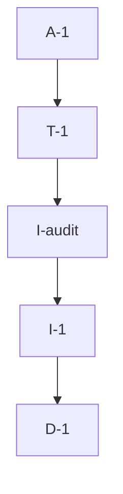

# Pipeline Plan

## Trigger
- Proposal: docs/versions/v0.1/modules/bucky-vpn/018-fix-windows-installer-version/proposal.md
- User launch confirmed: yes
- User launch statement: `确认， 自动完成`
- Launch stage: proposal
- First auto stage: design
- Design source: pipeline/plan.md
- Per-stage user confirmation: skipped by explicit user auto-pipeline authorization
- Auto-confirm completed document stages: automatic design/testing produce no design.md or testing.md; acceptance report is validated at completion
- Auto-pipeline document policy: stage-selective; no automatic design/testing Markdown; testplan.yaml required for automatic testing
- Version: v0.1
- Packet module: bucky-vpn
- Task name: 018-fix-windows-installer-version
- Target module(s): bucky-vpn
- change_id values: CHG-fix-windows-installer-version, CHG-audit-cross-platform-version-packaging

## Acceptance Baseline
- Final acceptance is judged against the launch-confirmed `proposal.md`.

## Stage Graph
| Task ID | Stage | Execution Mode | Responsibility | Scope | Parent Task | Depends On | Output | Done Condition |
|---------|-------|----------------|----------------|-------|-------------|------------|--------|----------------|
| D-1 | design | auto-pipeline | bind the cmd/PowerShell/ISPP repair and four-platform audit boundaries | both change ids | root | none | plan mappings and risk checks | structural plan validation passes |
| I-1 | implementation | auto-pipeline | fix Windows version propagation and remove duplicate resource version ownership | Windows build and version metadata | root | D-1 | corrected batch, Inno guard, and Cargo metadata | real batch reaches ISCC and no independent Windows version remains |
| I-audit | implementation | auto-pipeline | audit the three POSIX packaging entrypoints and preserve them when no defect is found | Debian, macOS, and server packaging contracts | root | I-1 | source-backed audit boundary | no speculative POSIX edit and applicable native evidence boundary is identified |
| T-1 | testing | auto-pipeline | implement red-green Windows regression and execute four-platform packaging evidence | all packaging contracts | root | I-audit | focused tests, testplan, and task run artifact | task-scoped all run passes with truthful native/manual boundaries |
| A-1 | acceptance | auto-pipeline | independently falsify requirement, design, implementation, and test adequacy | complete delivery | root | T-1 | acceptance report and final runtime state | no blocking defect remains and report/checkers accept delivery |

## Submodule Tasks
| Task ID | Stage | Execution Mode | Responsibility | Submodule | Parent Task | Depends On | Output | Done Condition |
|---------|-------|----------------|----------------|-----------|-------------|------------|--------|----------------|

## Parallel Scheduling
- Strategy: dependency-ready-set
- Concurrency: use all runtime-available child-agent slots and immediately backfill available capacity with useful dependency-ready work; this small repair remains serialized because testing depends on the corrected batch and acceptance depends on fresh evidence.
- Shared artifact owner: parent-orchestrator
- Coordination: practical edit coordination keeps shared task metadata, tests, runtime state, and acceptance evidence integrated by the parent without treating paths as permissions.
- Lock directory: `.harness/locks/`
- Serialization reasons: explicit dependency, edit coordination, or exhausted concurrency capacity only; D-1 owns the repair contract, I-1 implements it, T-1 captures red-green and real build evidence, and A-1 starts only after tests pass.
- Evidence: automatic task launches are recorded under `.harness/pipelines/v0.1/bucky-vpn/018-fix-windows-installer-version/state.json`.

## Dependency Graphs

| Level | Parent | Node | Depends On |
|-------|--------|------|------------|
| pipeline-task | root | D-1 | none |
| pipeline-task | root | I-1 | D-1 |
| pipeline-task | root | I-audit | I-1 |
| pipeline-task | root | T-1 | I-audit |
| pipeline-task | root | A-1 | T-1 |

## Exported Interfaces
| Interface | Owner | Consumer | Compatibility | Affected Callers | Migration Path |
|-----------|-------|----------|---------------|------------------|----------------|
| `cargo metadata --no-deps --format-version 1` output for unique `bucky-vpn` | `vpn-client/Cargo.toml` | four root packaging scripts | backward-compatible | local packagers and GitHub Actions jobs | keep the existing command; correct only Windows shell invocation |
| `AppVersion` ISPP public define | `build_win.bat` | `install.iss` | backward-compatible | Windows local/hosted build | pass quoted `/DAppVersion=<version>` and reject undefined or empty input |
| Windows executable product/file version | Cargo package metadata through winres defaults | Windows binary and installer consumers | backward-compatible | Windows Explorer and installer metadata | remove duplicate overrides so package.version is inherited |

## API and Build Surface Impact
- Public API impact: none
- Crate-root export change: no
- Build-surface change: yes
- Documentation examples affected: no

## Consumer Migration Closure
| Old Symbol | New Path | change_id | Consumer Path | Consumer Kind | Migration Status |
|------------|----------|-----------|---------------|---------------|------------------|
| PowerShell `$json = ^& cargo metadata` | PowerShell `$json = cargo metadata` | CHG-fix-windows-installer-version | `build_win.bat` | Windows packaging entrypoint | migrated |
| explicit `FileVersion` and `ProductVersion` strings | winres defaults from Cargo package.version | CHG-fix-windows-installer-version | `vpn-client/Cargo.toml` | Windows resource build | migrated |
| four packaging version paths previously checked mostly through fake tools | focused contracts plus real Windows and available Debian builds | CHG-audit-cross-platform-version-packaging | `tests/github_actions_build_contract.py` | validation consumer | migrated |

## State Ownership
| State | Owner | Access Interface | Lifecycle | Failure Transitions |
|-------|-------|------------------|-----------|---------------------|
| product version | `vpn-client/Cargo.toml` package.version | Cargo metadata and winres defaults | committed value is read at build time | missing/ambiguous/unsupported values fail before packaging |
| Windows installer version macro | `build_win.bat` | quoted ISCC command-line public define | exists only for one compiler process | undefined or empty value stops preprocessing |
| package staging/output | each platform script | temporary roots and `dist/` outputs | created per build | tool/build failures return nonzero and prevent accepted evidence |
| pipeline execution state | parent orchestrator | `.harness/pipelines/v0.1/bucky-vpn/018-fix-windows-installer-version/state.json` | pending to running to complete | defects return to I-1 or T-1 with iteration record |

## Failure Flows
| Flow | Boundary | Failure | Handling |
|------|----------|---------|----------|
| Windows version discovery | cmd `for /f` to PowerShell | quoting damage, Cargo failure, missing/duplicate package, unsupported version | return nonzero before Cargo release build and ISCC |
| Windows installer metadata | batch to ISPP | undefined or empty AppVersion | explicit preprocessing error before `[Setup]` parsing |
| Windows package build | Cargo to ISCC/output | binary/resource compiler/ISCC failure or missing installer | preserve nonzero exit and reject missing expected output |
| POSIX audit | Cargo/Python to packagers | version mismatch, missing tool, output or staged metadata error | strict shell failure; record native environment gap rather than a false pass |

## Rejected Alternatives
| Decision Type | Selected | Rejected | Reason |
|---------------|----------|----------|--------|
| technical | remove the unnecessary PowerShell call operator | add more cmd caret escaping | native command invocation needs no call operator and avoids nested-shell ambiguity |
| boundary | inherit winres versions from package.version | keep synchronized literal overrides | literals create a second authority and future drift |
| technical | execute the real Windows entrypoint | direct ISCC-only or text-only proof | only the batch path can expose the reproduced shell defect |
| boundary | preserve correct POSIX scripts after audit | refactor all version extraction | no confirmed defect justifies broader build-script churn |
| collaboration | serialize implementation, testing, and acceptance | concurrent edits to the shared batch/test contract | red-green evidence and independent acceptance require a stable implemented input |

## Implementation Scope Bindings
| change_id | target_module | proposal_id | design_coverage | scope_paths | design_rules_applied |
|-----------|---------------|-------------|-----------------|-------------|----------------------|
| CHG-fix-windows-installer-version | bucky-vpn | P-001 | cmd/PowerShell correction, winres version ownership, quoted ISPP input, empty guard, real Windows output | `build_win.bat`, `install.iss`, `vpn-client/Cargo.toml`, `tests/github_actions_build_contract.py` | single version owner, fail closed, red-green regression, real entrypoint |
| CHG-audit-cross-platform-version-packaging | bucky-vpn | P-002 | Debian/macOS/server/Windows source and executable contract audit with truthful native gaps | `build_deb.sh`, `build_macos.sh`, `build_server.sh`, `build_win.bat`, `vpn_deb/DEBIAN/control`, `Dockerfile`, `tests/github_actions_build_contract.py` | no speculative edits, metadata/output alignment, cleanup, environment boundary |

## File-Level Implementation Sequence
| Sequence | Task ID | File-Level Module | Action | Depends On | change_id | target_module | Scope Paths | Context Sources |
|----------|---------|-------------------|--------|------------|-----------|---------------|-------------|-----------------|
| 1 | I-1 | Windows packaging | correct shell invocation, remove duplicate winres versions, reject empty ISPP input | none | CHG-fix-windows-installer-version | bucky-vpn | `build_win.bat`, `install.iss`, `vpn-client/Cargo.toml` | proposal P-001 and Windows failure flows |
| 2 | I-audit | POSIX packaging contracts | inspect version propagation, metadata/output alignment, strict failures, and cleanup without speculative edits | I-1 | CHG-audit-cross-platform-version-packaging | bucky-vpn | `build_deb.sh`, `build_macos.sh`, `build_server.sh`, `build_win.bat`, `vpn_deb/DEBIAN/control`, `Dockerfile` | proposal P-002 and all failure flows |

## Return Rules
- Incorrect version ownership or repair shape returns to D-1.
- Batch, ISPP, Cargo metadata, or package behavior defects return to I-1.
- Missing red-green, weak cross-platform contracts, or false native claims return to T-1.
- Requirement ambiguity stops for user decision; the same unresolved issue stops after more than five unsuccessful iterations.

## Exit Conditions
- The reproduced Windows shell failure is eliminated and the real batch produces the expected installer.
- No independent Windows executable-resource version remains.
- Focused cross-platform contracts and task-scoped compile closure pass.
- Native Debian evidence is executed when supported; macOS/server native gaps remain explicit.
- Stage scope, complete pipeline state, and final independent acceptance pass.
