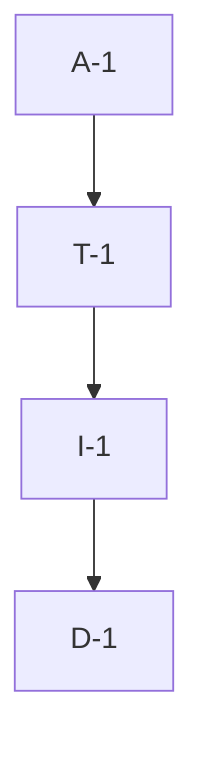

# Pipeline Plan

Risk profile: ./risk-profile.yaml

## Trigger
- Proposal: docs/versions/v0.1/modules/bucky-vpn/019-install-nasm-for-windows-action/proposal.md
- User launch confirmed: yes
- User launch statement: `确认， 自动完成任务`
- Launch stage: proposal
- First auto stage: design
- Design source: pipeline/plan.md
- Per-stage user confirmation: skipped by explicit user auto-pipeline authorization
- Auto-confirm completed document stages: automatic design/testing produce no design.md or testing.md; acceptance report is validated at completion
- Auto-pipeline document policy: stage-selective; no automatic design/testing Markdown; testplan.yaml required for automatic testing
- Version: v0.1
- Packet module: bucky-vpn
- Task name: 019-install-nasm-for-windows-action
- Target module(s): bucky-vpn
- change_id values: CHG-provision-windows-nasm

## Acceptance Baseline
- Final acceptance is judged against the launch-confirmed `proposal.md`.

## Stage Graph
| Task ID | Stage | Execution Mode | Responsibility | Scope | Parent Task | Depends On | Output | Done Condition |
|---------|-------|----------------|----------------|-------|-------------|------------|--------|----------------|
| D-1 | design | auto-pipeline | bind pinned NASM provisioning, deterministic package-install-path verification, unchanged build entrypoint, and hosted evidence boundaries | CHG-provision-windows-nasm | root | none | plan mappings and risk checks | structural plan validation passes without design.md or task-local design artifacts |
| I-1 | implementation | auto-pipeline | add the minimal NASM setup and fail-fast check to the Windows job | `.github/workflows/build.yml` | root | D-1 | updated workflow | pinned installation and version check precede unchanged build_win.bat invocation |
| T-1 | testing | auto-pipeline | derive post-implementation coverage and collect task-scoped evidence | delivered workflow and affected build closure | root | I-1 | testplan, runnable evidence, and runtime testing state | coverage is traceable and hosted Windows evidence is recorded truthfully |
| A-1 | acceptance | auto-pipeline | independently review requirement, design, implementation, supply-chain boundary, and evidence adequacy | complete delivery | root | T-1 | acceptance report and final runtime state | no blocking defect remains and acceptance checks pass |

## Submodule Tasks
| Task ID | Stage | Execution Mode | Responsibility | Submodule | Parent Task | Depends On | Output | Done Condition |
|---------|-------|----------------|----------------|-----------|-------------|------------|--------|----------------|

## Parallel Scheduling
- Strategy: dependency-ready-set
- Concurrency: use all runtime-available child-agent slots and immediately backfill available capacity with useful dependency-ready work; this one-file change is serialized because implementation depends on the completed toolchain contract, testing depends on the workflow edit, and acceptance depends on fresh evidence.
- Shared artifact owner: parent-orchestrator
- Coordination: practical edit coordination keeps the shared workflow, task metadata, runtime state, and acceptance evidence integrated without treating paths as permissions.
- Lock directory: `.harness/locks/`
- Serialization reasons: explicit dependency, edit coordination, or exhausted concurrency capacity only; no independent implementation unit exists inside the single workflow file.
- Evidence: automatic task launches are recorded under `.harness/pipelines/v0.1/bucky-vpn/019-install-nasm-for-windows-action/state.json`.

## Dependency Graphs

| Level | Parent | Node | Depends On |
|-------|--------|------|------------|
| pipeline-task | root | D-1 | none |
| pipeline-task | root | I-1 | D-1 |
| pipeline-task | root | T-1 | I-1 |
| pipeline-task | root | A-1 | T-1 |

## Exported Interfaces
| Interface | Owner | Consumer | Compatibility | Affected Callers | Migration Path |
|-----------|-------|----------|---------------|------------------|----------------|
| `%ProgramFiles%\NASM\nasm.exe` at Chocolatey package version 2.16.3, with `%ProgramFiles%\NASM` exported to later steps | Windows NASM setup step in `.github/workflows/build.yml` | `aws-lc-sys` native build launched by `build_win.bat` | backward-compatible | hosted `build-windows` job | install the exact Chocolatey package, validate its deterministic installation path, export that directory through `GITHUB_PATH`, and prove command discovery with `nasm -v` before Cargo starts |

## API and Build Surface Impact
- Public API impact: none
- Crate-root export change: no
- Build-surface change: yes
- Documentation examples affected: no

## Consumer Migration Closure
| Old Symbol | New Path | change_id | Consumer Path | Consumer Kind | Migration Status |
|------------|----------|-----------|---------------|---------------|------------------|
| absent NASM tool contract | pinned Chocolatey `nasm` 2.16.3 plus `%ProgramFiles%\NASM\nasm.exe` validation and PATH-visible `nasm -v` | CHG-provision-windows-nasm | `.github/workflows/build.yml` | hosted Windows build workflow | migrated |

## State Ownership
| State | Owner | Access Interface | Lifecycle | Failure Transitions |
|-------|-------|------------------|-----------|---------------------|
| job-local NASM installation and PATH availability | Windows NASM setup step | Chocolatey installation followed by `Test-Path` against `$env:ProgramFiles\NASM\nasm.exe` and `GITHUB_PATH` publication of `$env:ProgramFiles\NASM` | absent after checkout, installed at exact version in the package-defined directory, verified before build, discarded with hosted runner | installation failure, missing expected executable, or unsuccessful `nasm -v` terminates the job before Cargo; no partial installer is accepted |
| Windows installer artifact | existing `build_win.bat` and verify steps | unchanged batch entrypoint and versioned `dist` path | built only after NASM verification and checked before upload | native build failure or missing expected file preserves nonzero failure and prevents artifact upload |

## Failure Flows
| Flow | Boundary | Failure | Handling |
|------|----------|---------|----------|
| NASM provisioning | hosted `windows-2022` runner to Chocolatey community package | package version unavailable, repository outage, checksum rejection, or install failure | exact-version installation returns nonzero and stops before the native build |
| NASM discovery | Chocolatey-installed tool to subsequent PowerShell/Cargo process | package install path differs, executable is absent, PATH handoff fails, or executable is unusable | validate `$env:ProgramFiles\NASM\nasm.exe`, publish its directory through `GITHUB_PATH`, then let the separate `nasm -v` step fail before `build_win.bat` if command handoff or execution is unusable |
| AWS-LC native compilation | `build_win.bat` Cargo process to `aws-lc-sys` | assembler invocation or native compilation fails | preserve Cargo/batch nonzero exit; do not enable crate-provided prebuilt objects or change crypto features |
| installer completion | native build to existing installer verification | expected versioned executable is absent | unchanged verification rejects the job and prevents artifact upload |

## Rejected Alternatives
| Decision Type | Selected | Rejected | Reason |
|---------------|----------|----------|--------|
| boundary | modify only the hosted Windows workflow tool provisioning | modify `build_win.bat`, Rust dependencies, crypto-provider features, or non-Windows jobs | the reproduced failure is runner-tool availability before the existing build entrypoint, so broader product/build changes would exceed the confirmed scope |
| technical | `choco install nasm --version=2.16.3 --yes --no-progress`, deterministic `$env:ProgramFiles\NASM\nasm.exe` validation, `GITHUB_PATH` publication, and a separate `nasm -v` step | Machine/User PATH refresh, recursive filesystem search, unpinned latest NASM, direct mutable URL download, or AWS-LC prebuilt NASM objects | the package's own uninstall contract identifies `%ProgramFiles%\NASM`; explicit validation avoids the hosted-proven false assumption that the installer mutates PATH, while the exact Chocolatey pin and separate check constrain drift and preserve source compilation |
| collaboration | serialize design, one-file implementation, evidence collection, and acceptance | concurrent edits to the same workflow and evidence boundary | each downstream result depends on the stable output of the preceding stage and there is no disjoint file-level implementation work |

## Implementation Scope Bindings
| change_id | target_module | proposal_id | design_coverage | scope_paths | design_rules_applied |
|-----------|---------------|-------------|-----------------|-------------|----------------------|
| CHG-provision-windows-nasm | bucky-vpn | P-001 | exact Chocolatey NASM 2.16.3 provisioning, deterministic `%ProgramFiles%\NASM\nasm.exe` validation, explicit PATH-visible version check, unchanged batch/dependency/installer boundaries, and hosted Windows evidence | `.github/workflows/build.yml` | single workflow owner, pinned external dependency, package-defined installation boundary, fail-fast discovery, unchanged consumer contract, explicit platform evidence gap |

## File-Level Implementation Sequence
| Sequence | Task ID | File-Level Module | Action | Depends On | change_id | target_module | Scope Paths | Context Sources |
|----------|---------|-------------------|--------|------------|-----------|---------------|-------------|-----------------|
| 1 | I-1 | `.github/workflows/build.yml` | install exact NASM 2.16.3, validate `$env:ProgramFiles\NASM\nasm.exe`, publish `$env:ProgramFiles\NASM` through `GITHUB_PATH`, and run `nasm -v` before the unchanged build command | none | CHG-provision-windows-nasm | bucky-vpn | `.github/workflows/build.yml` | proposal P-001, risk profile contract/security/build checks, Chocolatey package install/uninstall contract, hosted run 31716578412, current build-windows job |

## Return Rules
- A wrong provisioning boundary, unpinned tool, changed dependency/build entrypoint, or missing supply-chain decision returns to D-1.
- Incorrect workflow ordering, package arguments, PATH behavior, or accidental non-Windows/build-script changes return to I-1.
- Missing task coverage, stale run artifacts, or hosted evidence represented as a local pass returns to T-1.
- Proposal ambiguity stops for user decision; the same unresolved issue stops after more than five unsuccessful iterations.

## Exit Conditions
- The workflow installs NASM through Chocolatey at exactly package version 2.16.3, validates `$env:ProgramFiles\NASM\nasm.exe`, publishes `$env:ProgramFiles\NASM` through `GITHUB_PATH`, and records `nasm -v` before Cargo starts.
- `build_win.bat`, the Rust dependency graph and crypto-provider selection, the expected installer path, release triggers, and other jobs remain unchanged.
- Local workflow/configuration checks pass and a hosted `windows-2022` run gets past the prior `NASM command not found` failure, compiles `aws-lc-sys`, and passes existing installer verification.
- If hosted Windows execution is unavailable, acceptance records it as an explicit manual evidence gate and does not claim the native build passed.
- Stage scope, complete runtime state, and final independent acceptance checks pass before task completion.

Execution status, testing evidence, return records, and final acceptance are stored in `.harness/pipelines/v0.1/bucky-vpn/019-install-nasm-for-windows-action/state.json`; they are deliberately excluded from this admission-bound plan.
