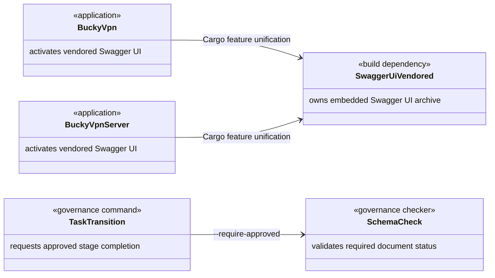
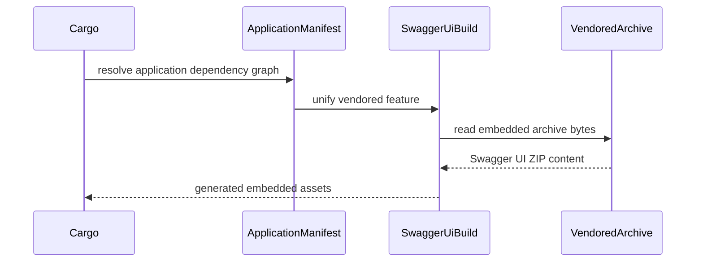
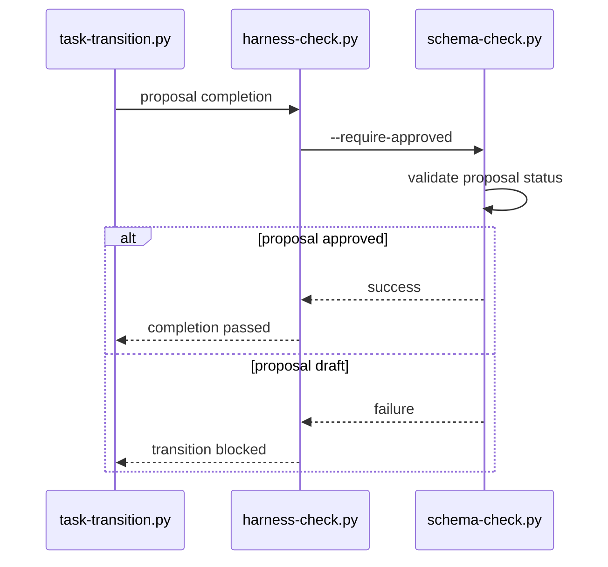

# Vendored Swagger UI and Proposal Gate Design

Risk profile: ./risk-profile.yaml

## Design Scope

### Goals
- Unify the `utoipa-swagger-ui/vendored` feature into both application dependency graphs without changing OpenAPI runtime behavior.
- Restore the existing Harness proposal approval contract so the canonical transition command can verify approval and record its receipt.
- Keep the implementation localized to existing Cargo manifests and existing Harness command boundaries.

### Non-goals
- No new runtime module, exported Rust API, OpenAPI schema, or configuration surface.
- No dependency version upgrade beyond Cargo's current compatible resolution.
- No redesign of the Harness stage model or approval policy.

## Useful Context
- `sfo-http 0.6.8` enables `utoipa-swagger-ui` through `openapi` but exposes no feature forwarding for `vendored`.
- Cargo feature unification permits each application crate to activate the transitive crate's `vendored` feature with a direct dependency declaration.
- `harness-check.py` intentionally calls `schema-check.py --require-approved` at proposal completion; `schema-check.py` already validates the status of every required document, so its proposal-stage early rejection is the only contradictory behavior.
- The first failed `task-transition.py` invocation is the pre-fix reproduction; the minimal guard removal has restored legal entry into this design stage.

## Overall Approach
Add the same `utoipa-swagger-ui 9.0.2` direct dependency with `vendored` enabled to the client and server application crates, allowing Cargo to unify that feature with the transitive instance selected by `sfo-http`. Preserve the current lock resolution and accept only the additional vendored-assets package needed by that feature.

For Harness, retain `--require-approved` and its existing document-status enforcement. Remove only the proposal-stage prohibition so an approved proposal passes and a draft proposal continues to fail through `validate_doc`. Dedicated governance coverage will exercise that public command behavior through the existing unified runner boundary.

## Layered Design Document Index
| level | parent_document | unit | design_document | responsibility |
|-------|-----------------|------|-----------------|----------------|
| root | `design.md` | cross-project build and governance task | `design.md` | complete dependency/build and Harness command design; no independent child submodule is introduced |

## Module Relationship UML


## File-Level Interfaces
```python
def main() -> int:
    """schema-check CLI; --require-approved validates every required document for the active manual stage."""
    ...
```

- Consumer: `harness/scripts/harness-check.py` and `harness/scripts/task-transition.py` / `CHG-proposal-approval-gate`
- Compatibility: backward-compatible
- Migration path when required: not applicable; the repair makes the implemented behavior match the existing CLI help and workflow contract.

## API and Build Surface Impact
- Public API impact: none
- Crate-root export change: no
- Build-surface change: yes
- Documentation examples affected: no

## Consumer Migration Closure
| Old Symbol | New Path | change_id | Consumer Path | Consumer Kind | Migration Status |
|------------|----------|-----------|---------------|---------------|------------------|
| `utoipa-swagger-ui` default remote asset source | `utoipa-swagger-ui/vendored` | CHG-vendored-swagger-ui-client | `vpn-client/Cargo.toml` | application build manifest | migrated |
| `utoipa-swagger-ui` default remote asset source | `utoipa-swagger-ui/vendored` | CHG-vendored-swagger-ui-server | `vpn-server/Cargo.toml` | application build manifest | migrated |

## Key Flows




## State and Ownership
not-applicable: the task changes no persistent data or shared runtime state; Cargo owns feature resolution and the Harness task packet owns approval status.

## Directly Mapped Change Items
| change_id | target_module | proposal_id | Design Coverage | Scope Paths | Interface / Boundary Impact | Notes |
|-----------|---------------|-------------|-----------------|-------------|-----------------------------|-------|
| CHG-vendored-swagger-ui-client | bucky-vpn | P-001 | Overall approach, build flow, migration closure | `vpn-client/Cargo.toml`, `Cargo.lock` | build-only; no runtime API impact | Direct declaration exists only to unify the transitive feature. |
| CHG-vendored-swagger-ui-server | bucky-vpn-server | P-002 | Overall approach, build flow, migration closure | `vpn-server/Cargo.toml`, `Cargo.lock` | build-only; no runtime API impact | Mirrors the client so independent server builds are reproducible. |
| CHG-proposal-approval-gate | repo-governance | P-003 | Harness interface and approval flow, including the acceptance-return correction that keeps pre-launch manual receipts valid | `harness/scripts/schema-check.py`, `harness/scripts/lifecycle-check.py`, `harness/scripts/test-run.py`, `harness/tests/test_schema_check_proposal_approval.py` | backward-compatible CLI corrections | Preserve approval and artifact enforcement; receipt migration is explicit and ordinary validation remains read-only. |

## Implementation Order
| Phase | Goal | Depends On | Output |
|-------|------|------------|--------|
| 1 | Restore the declared proposal approval CLI behavior | approved proposal | corrected schema approval guard |
| 2 | Activate vendored assets in both application graphs | approved dependency design | client and server Cargo declarations plus controlled lock resolution |

## File-Level Implementation Sequence
| sequence | file_level_module | action | depends_on | change_id | scope_path | implementation_task |
|----------|-------------------|--------|------------|-----------|------------|---------------------|
| 1 | `harness/scripts/schema-check.py` | modify | none | CHG-proposal-approval-gate | `harness/scripts/schema-check.py` | I-001 |
| 2 | `harness/scripts/lifecycle-check.py` | keep manual receipt binding stable across legal auto-pipeline metadata changes and add explicit checked legacy migration | none | CHG-proposal-approval-gate | `harness/scripts/lifecycle-check.py` | I-001 |
| 3 | `vpn-client/Cargo.toml` | modify | none | CHG-vendored-swagger-ui-client | `vpn-client/Cargo.toml` | I-002 |
| 4 | `vpn-server/Cargo.toml` | modify | none | CHG-vendored-swagger-ui-server | `vpn-server/Cargo.toml` | I-003 |
| 5 | `Cargo.lock` | update client-required vendored resolution | I-002 | CHG-vendored-swagger-ui-client | `Cargo.lock` | I-004 |
| 6 | `Cargo.lock` | preserve the same integrated resolution for the server graph | I-003 | CHG-vendored-swagger-ui-server | `Cargo.lock` | I-004 |

## Design Notes
- Direct dependencies are preferred over changing or forking `sfo-http`; they use Cargo's standard feature-unification semantics and avoid maintaining an upstream patch.
- Enabling `reqwest` was rejected because it retains build-time networking and adds a larger downloader dependency graph without addressing offline reproducibility.
- A global curl configuration workaround was rejected because it is host-specific and can weaken certificate revocation behavior.
- The Harness repair does not remove `--require-approved`; draft documents remain rejected by the existing status check.
- No new submodule is introduced because each change is a localized declaration or guard correction within an existing responsibility.

## Risks and Rollback
- If the vendored feature selects unexpected packages, revert the two direct declarations and required lockfile delta; this restores the previous remote-download behavior.
- If proposal approval behavior differs outside the canonical manual transition, revert the guard correction; the focused governance evidence must demonstrate both approved success and draft rejection before acceptance.
- Review must separate pre-existing untracked `Cargo.lock` content from the minimal dependency delta produced by feature activation.
