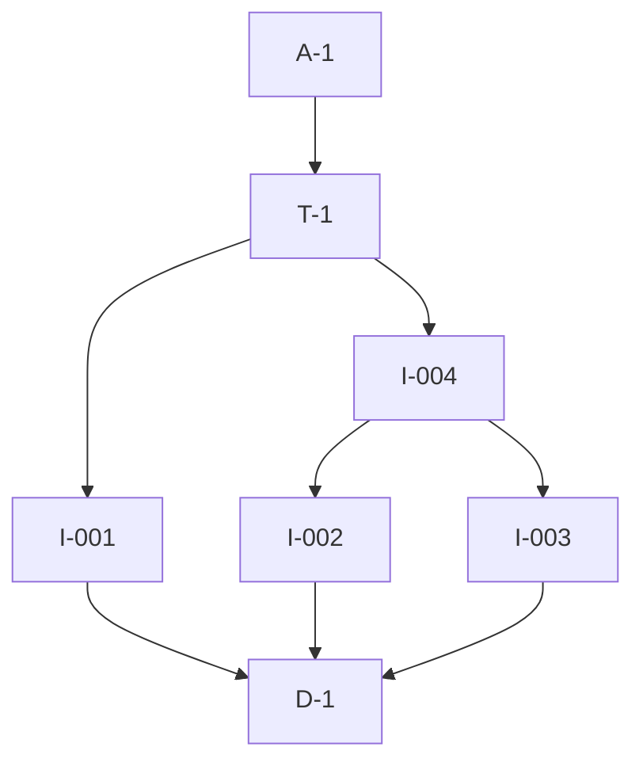

# Pipeline Plan

## Trigger
- Proposal: docs/versions/v0.1/modules/globals/001-vendored-swagger-ui/proposal.md
- User launch confirmed: yes
- User launch statement: 确认，自动完成任务
- Launch stage: design
- First auto stage: implementation
- Design source: design.md
- Per-stage user confirmation: skipped by explicit user auto-pipeline authorization
- Auto-confirm completed document stages: automatic testing produces no testing Markdown; acceptance report is validated at completion
- Auto-pipeline document policy: stage-selective; manual design.md retained; no automatic testing Markdown; testplan.yaml required for automatic testing
- Version: v0.1
- Packet module: globals
- Task name: 001-vendored-swagger-ui
- Target module(s): bucky-vpn, bucky-vpn-server, repo-governance
- change_id values: CHG-vendored-swagger-ui-client, CHG-vendored-swagger-ui-server, CHG-proposal-approval-gate

## Acceptance Baseline
- Final acceptance is judged against the launch-confirmed `proposal.md` and approved manual `design.md`.

## Stage Graph
| Task ID | Stage | Execution Mode | Responsibility | Scope | Parent Task | Depends On | Output | Done Condition |
|---------|-------|----------------|----------------|-------|-------------|------------|--------|----------------|
| D-1 | design | manual | approve dependency and Harness correction design | bound task packet | root | none | approved `design.md` | design checks pass and user approval is recorded |
| I-001 | implementation | auto-pipeline | apply the bounded proposal approval checker correction | repo-governance checker | root | D-1 | corrected `schema-check.py` | approved proposal path works without weakening draft rejection |
| I-002 | implementation | auto-pipeline | activate vendored Swagger UI for the client | bucky-vpn build manifest | root | D-1 | updated client Cargo manifest | client graph requests the vendored feature |
| I-003 | implementation | auto-pipeline | activate vendored Swagger UI for the server | bucky-vpn-server build manifest | root | D-1 | updated server Cargo manifest | server graph requests the vendored feature |
| I-004 | implementation | auto-pipeline | reconcile dependency resolution after both manifest changes | workspace lock resolution | root | I-002, I-003 | controlled `Cargo.lock` update | lock delta contains only required vendored resolution changes |
| T-1 | testing | auto-pipeline | derive and implement task-scoped verification from proposal, design, and delivered code | all three change ids | root | I-001, I-004 | test code, runner wiring, `testplan.yaml`, runtime evidence | task-scoped all run succeeds and covers every change id |
| A-1 | acceptance | auto-pipeline | review requirements and current delivery, then close or return defects | complete delivery | root | T-1 | `acceptance-report.md` and final runtime state | report is accepted and all exit conditions pass |

## Submodule Tasks
| Task ID | Stage | Execution Mode | Responsibility | Submodule | Parent Task | Depends On | Output | Done Condition |
|---------|-------|----------------|----------------|-----------|-------------|------------|--------|----------------|

## Parallel Scheduling
- Strategy: dependency-ready-set
- Concurrency: use all runtime-available child-agent slots and immediately backfill available capacity.
- Shared artifact owner: parent-orchestrator
- Coordination: practical edit coordination avoids simultaneous mutation of shared files without treating paths as permissions.
- Lock directory: `.harness/locks/`
- Serialization reasons: explicit dependency, edit coordination, or exhausted concurrency capacity only.
- Evidence: record automatic task launches and reasons under `.harness/pipelines/v0.1/globals/001-vendored-swagger-ui/state.json`; manual D-1 never appears in a wave.

## Dependency Graphs

| Level | Parent | Node | Depends On |
|-------|--------|------|------------|
| pipeline-task | root | D-1 | none |
| pipeline-task | root | I-001 | D-1 |
| pipeline-task | root | I-002 | D-1 |
| pipeline-task | root | I-003 | D-1 |
| pipeline-task | root | I-004 | I-002, I-003 |
| pipeline-task | root | T-1 | I-001, I-004 |
| pipeline-task | root | A-1 | T-1 |

## Exported Interfaces
| Interface | Owner | Consumer | Compatibility | Affected Callers | Migration Path |
|-----------|-------|----------|---------------|------------------|----------------|
| `schema-check.py --require-approved` | repo-governance | `harness/scripts/harness-check.py` | backward-compatible | canonical task transition | none |

## API and Build Surface Impact
- Public API impact: none
- Crate-root export change: no
- Build-surface change: yes
- Documentation examples affected: no

## Consumer Migration Closure
| Old Symbol | New Path | change_id | Consumer Path | Consumer Kind | Migration Status |
|------------|----------|-----------|---------------|---------------|------------------|
| remote Swagger UI asset source | `utoipa-swagger-ui/vendored` | CHG-vendored-swagger-ui-client | `vpn-client/Cargo.toml` | build manifest | migrated |
| remote Swagger UI asset source | `utoipa-swagger-ui/vendored` | CHG-vendored-swagger-ui-server | `vpn-server/Cargo.toml` | build manifest | migrated |

## State Ownership
| State | Owner | Access Interface | Lifecycle | Failure Transitions |
|-------|-------|------------------|-----------|---------------------|
| pipeline execution state | parent orchestrator | `.harness/pipelines/v0.1/globals/001-vendored-swagger-ui/state.json` | pending to running to complete | failed work returns to its owning task and records a return entry |

## Failure Flows
| Flow | Boundary | Failure | Handling |
|------|----------|---------|----------|
| vendored dependency resolution | application manifest to Cargo registry/cache | vendored crate unavailable or unrelated lock drift | stop implementation, preserve current resolution, and report the dependency failure |
| proposal approval transition | harness-check to schema-check | approved proposal rejected or draft accepted | return to I-001 and preserve the existing approval requirement |

## Rejected Alternatives
| Decision Type | Selected | Rejected | Reason |
|---------------|----------|----------|--------|
| boundary | direct application feature unification | fork or patch `sfo-http` | the upstream crate need not change to unify a transitive Cargo feature |
| technical | vendored Swagger UI asset crate | reqwest or global curl weakening | vendoring removes build-time networking and host-specific TLS behavior |
| collaboration | independent manifest workers with parent-owned lock integration | concurrent lockfile regeneration | one integration point avoids conflicting or unrelated resolution drift |

## Implementation Scope Bindings
| change_id | target_module | proposal_id | design_coverage | scope_paths | design_rules_applied |
|-----------|---------------|-------------|-----------------|-------------|----------------------|
| CHG-vendored-swagger-ui-client | bucky-vpn | P-001 | approved `design.md` dependency activation and build flow | `vpn-client/Cargo.toml`, `Cargo.lock` | manual design decomposition, build impact, migration closure |
| CHG-vendored-swagger-ui-server | bucky-vpn-server | P-002 | approved `design.md` dependency activation and build flow | `vpn-server/Cargo.toml`, `Cargo.lock` | manual design decomposition, build impact, migration closure |
| CHG-proposal-approval-gate | repo-governance | P-003 | approved `design.md` checker interface and approval flow | `harness/scripts/schema-check.py`, `harness/scripts/test-run.py`, `harness/tests/test_schema_check_proposal_approval.py` | manual design interfaces, failure flow, compatibility |

## File-Level Implementation Sequence
The authoritative file-level sequence is in the approved manual `design.md`; its `implementation_task` values bind to I-001 through I-004 above.

## Return Rules
- Proposal ambiguity or an incorrect acceptance boundary stops the pipeline for user decision.
- A checker or Cargo delivery defect returns to the matching implementation task.
- Missing or incorrect task evidence returns to T-1.
- A stale manual design returns to design only when delivered behavior still satisfies the proposal.
- The same unresolved issue stops after more than five unsuccessful return iterations.

## Exit Conditions
- Proposal outcomes satisfied.
- Required task-scoped evidence exists for all change ids.
- Stage scope checks pass.
- Final acceptance report is accepted.
