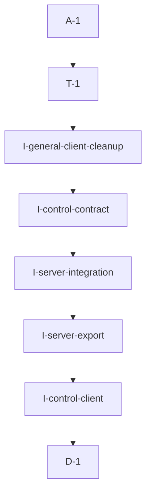

# Pipeline Plan

Risk profile: ./risk-profile.yaml

## Trigger
- Proposal: docs/versions/v0.1/modules/globals/008-separate-pn-control-client/proposal.md
- User launch confirmed: yes
- User launch statement: 确认，自动完成任务
- Launch stage: proposal
- First auto stage: design
- Design source: pipeline/plan.md
- Per-stage user confirmation: skipped by explicit user auto-pipeline authorization
- Auto-confirm completed document stages: no design/testing Markdown documents generated; acceptance report is validated at completion
- Auto-pipeline document policy: stage-selective; no automatic design/testing Markdown; testplan.yaml required for automatic testing
- Version: v0.1
- Packet module: globals
- Task name: 008-separate-pn-control-client
- Target module(s): vpn-frame, bucky-vpn-server
- change_id values: CHG-dedicated-pn-control-client, CHG-pn-control-client-integration

## Acceptance Baseline
- Final acceptance is judged against the launch-confirmed `proposal.md` and this automatic-design mapping.

## Stage Graph
| Task ID | Stage | Execution Mode | Responsibility | Scope | Parent Task | Depends On | Output | Done Condition |
|---------|-------|----------------|----------------|-------|-------------|------------|--------|----------------|
| D-1 | design | auto-pipeline | map the dedicated PN-to-control-plane client boundary, public interface, migration, state, and failure behavior | bound cross-project task packet | root | none | complete pipeline-plan design mappings and risk checks | design structure and both target-module scope bindings pass without a design.md |
| I-control-client | implementation | auto-pipeline | add the dedicated control client and its VpnControlClientOps implementation | vpn-frame server client module | root | D-1 | vpn_control_client.rs | new server-module client owns and executes all four control commands |
| I-server-export | implementation | auto-pipeline | export the dedicated client from vpn_frame::server | vpn-frame server module assembly | root | I-control-client | updated server/mod.rs | downstream code can name vpn_frame::server::VpnControlClient |
| I-server-integration | implementation | auto-pipeline | migrate PN runtime construction and injection to the dedicated client | bucky-vpn-server PN control assembly | root | I-server-export | updated pn_control_client.rs | all production PN control consumers use the dedicated client |
| I-control-contract | implementation | auto-pipeline | remove the obsolete VpnServerClient trait implementation from the abstract control-channel boundary | vpn-frame control-channel contract | root | I-server-integration | updated control_channel.rs | no VpnControlClientOps implementation remains for VpnServerClient |
| I-general-client-cleanup | implementation | auto-pipeline | remove PN control command methods and imports from the ordinary VPN server client | vpn-frame general client | root | I-control-contract | updated vpn_server_client.rs | VpnServerClient retains only ordinary VPN client-to-server responsibilities |
| T-1 | testing | auto-pipeline | derive and execute task-scoped ownership, behavior, focused test, and compile-closure verification | delivered vpn-frame and vpn-server code | root | I-general-client-cleanup | testplan.yaml, runtime coverage, and test-run artifact | every risk check and change id has passing task-scoped evidence or a concrete gap |
| A-1 | acceptance | auto-pipeline | review requirement, design, implementation, and evidence consistency and close or return defects | complete delivery | root | T-1 | acceptance-report.md and final runtime state | report is accepted and pipeline exit checks pass |

## Submodule Tasks
| Task ID | Stage | Execution Mode | Responsibility | Submodule | Parent Task | Depends On | Output | Done Condition |
|---------|-------|----------------|----------------|-----------|-------------|------------|--------|----------------|

No deeper submodule tasks are created. The two real ownership boundaries are already represented by the `vpn-frame` client-definition tasks and the dependent `bucky-vpn-server` assembly task; another nesting level would duplicate file-level work without an independent business owner.

## Parallel Scheduling
- Strategy: dependency-ready-set
- Concurrency: use all runtime-available child-agent slots when dependencies permit and immediately backfill available capacity.
- Shared artifact owner: parent-orchestrator
- Coordination: practical edit coordination serializes the client definition, export, consumer migration, and old-surface removal because each step depends on the preceding public interface state; this is coordination, not a file permission rule.
- Lock directory: `.harness/locks/`
- Serialization reasons: explicit dependency, edit coordination, or exhausted concurrency capacity only.
- Evidence: record automatic task launches and reasons under `.harness/pipelines/v0.1/globals/008-separate-pn-control-client/state.json`.

## Dependency Graphs


Arrows point from each dependent task to its prerequisite.

| Level | Parent | Node | Depends On |
|-------|--------|------|------------|
| pipeline-task | root | D-1 | none |
| pipeline-task | root | I-control-client | D-1 |
| pipeline-task | root | I-server-export | I-control-client |
| pipeline-task | root | I-server-integration | I-server-export |
| pipeline-task | root | I-control-contract | I-server-integration |
| pipeline-task | root | I-general-client-cleanup | I-control-contract |
| pipeline-task | root | T-1 | I-general-client-cleanup |
| pipeline-task | root | A-1 | T-1 |

## Exported Interfaces
| Interface | Owner | Consumer | Compatibility | Affected Callers | Migration Path |
|-----------|-------|----------|---------------|------------------|----------------|
| `vpn_frame::server::VpnControlClient` generic type and `new` constructor | vpn-frame server control client | `vpn-server/src/pn_control_client.rs` / CHG-pn-control-client-integration | new | none | construct this dedicated type with the existing concrete ControlCmdClient and tunnel factory |
| `VpnControlClientOps` implementation for the dedicated server client | vpn-frame server control client | vpn-frame reporter/validator cores and vpn-server PN runtime | migration-required | `vpn-server/src/pn_control_client.rs` | replace the VpnServerClient concrete alias with the dedicated type while retaining VpnControlClientOpsRef injection |
| removed `VpnServerClient::{report_pn_traffic_stats, report_proxy_heartbeat, report_proxy_traffic, validate_pn_connection}` | vpn-frame general client | current repository caller in `vpn-server/src/pn_control_client.rs` | breaking | `vpn-server/src/pn_control_client.rs` | migrate the caller to the same-named operations through `vpn_frame::server::VpnControlClient` and its trait implementation |

## File-Level Interfaces
```rust
pub struct VpnControlClient<M, S, G, T>
where
    M: CmdTunnelMeta,
    S: CmdSend<M>,
    G: SendGuard<M, S>,
    T: CmdClient<VpnCmdPkgLen, u8, M, S, G>;

impl<M, S, G, T> VpnControlClient<M, S, G, T> {
    pub fn new(cmd_client: Arc<T>, conn_timeout: Duration) -> Arc<Self>;
}

#[async_trait]
impl<M, S, G, T> VpnControlClientOps for VpnControlClient<M, S, G, T> {
    async fn report_pn_traffic_stats(&self, reports: Vec<NodeTrafficReport>) -> VpnResult<Vec<NodeTrafficReportResp>>;
    async fn report_proxy_heartbeat(&self, heartbeat: ProxyNodeHeartbeat) -> VpnResult<()>;
    async fn report_proxy_traffic(&self, reports: Vec<ProxyTrafficReport>) -> VpnResult<Vec<ProxyTrafficReportResp>>;
    async fn validate_pn_connection(&self, from: NodeId, to: NodeId) -> VpnResult<Option<ValidatedPnConnection>>;
}
```

The concrete consumer is CHG-pn-control-client-integration in `vpn-server/src/pn_control_client.rs`. The new class is a new API; moving the old methods/trait implementation is migration-required and removing the old methods is breaking for direct callers, which are migrated in this repository.

## API and Build Surface Impact
- Public API impact: breaking
- Crate-root export change: no
- Build-surface change: no
- Documentation examples affected: no
- Impact detail: `vpn_frame::server` gains a public `VpnControlClient`, while the public general `VpnServerClient` loses four PN control-plane methods and its `VpnControlClientOps` implementation. No Cargo dependency, feature, generated artifact, or crate-root re-export changes.

## Consumer Migration Closure
| Old Symbol | New Path | change_id | Consumer Path | Consumer Kind | Migration Status |
|------------|----------|-----------|---------------|---------------|------------------|
| generic `VpnControlClientOps for VpnServerClient` implementation | `VpnControlClientOps` implementation for `vpn_frame::server::VpnControlClient` | CHG-dedicated-pn-control-client | vpn-server/src/pn_control_client.rs | concrete workspace consumer | migrated |
| `VpnServerClient::report_pn_traffic_stats` | `VpnControlClientOps::report_pn_traffic_stats` on `vpn_frame::server::VpnControlClient` | CHG-pn-control-client-integration | vpn-server/src/pn_control_client.rs | concrete workspace consumer | migrated |
| `VpnServerClient::report_proxy_heartbeat` | `VpnControlClientOps::report_proxy_heartbeat` on `vpn_frame::server::VpnControlClient` | CHG-pn-control-client-integration | vpn-server/src/pn_control_client.rs | concrete workspace consumer | migrated |
| `VpnServerClient::report_proxy_traffic` | `VpnControlClientOps::report_proxy_traffic` on `vpn_frame::server::VpnControlClient` | CHG-pn-control-client-integration | vpn-server/src/pn_control_client.rs | concrete workspace consumer | migrated |
| `VpnServerClient::validate_pn_connection` | `VpnControlClientOps::validate_pn_connection` on `vpn_frame::server::VpnControlClient` | CHG-pn-control-client-integration | vpn-server/src/pn_control_client.rs | concrete workspace consumer | migrated |
| `VpnServerClient::report_pn_traffic_stats` | intentionally rejected old path | CHG-dedicated-pn-control-client | tests/fixtures/sfo_cmd_server_0_4_consumer/examples/removed_vpn_control_api.rs | external negative fixture | allowed-negative-fixture |
| `VpnServerClient::report_proxy_heartbeat` | intentionally rejected old path | CHG-dedicated-pn-control-client | tests/fixtures/sfo_cmd_server_0_4_consumer/examples/removed_vpn_control_api.rs | external negative fixture | allowed-negative-fixture |
| `VpnServerClient::report_proxy_traffic` | intentionally rejected old path | CHG-dedicated-pn-control-client | tests/fixtures/sfo_cmd_server_0_4_consumer/examples/removed_vpn_control_api.rs | external negative fixture | allowed-negative-fixture |
| `VpnServerClient::validate_pn_connection` | intentionally rejected old path | CHG-dedicated-pn-control-client | tests/fixtures/sfo_cmd_server_0_4_consumer/examples/removed_vpn_control_api.rs | external negative fixture | allowed-negative-fixture |

## State Ownership
| State | Owner | Access Interface | Lifecycle | Failure Transitions |
|-------|-------|------------------|-----------|---------------------|
| control command transport, VPN command version, connection timeout, and request sequence generator | `vpn_frame::server::VpnControlClient` | constructor plus `VpnControlClientOps` methods | constructed once from the PN runtime's command client, shared through Arc/trait-object references, used for request sequencing, and dropped with the PN runtime | send/read/decode/non-zero-result failures return the existing VpnError without mutating ownership or adding retry; later calls retain the client and sequence generator |

## Failure Flows
| Flow | Boundary | Failure | Handling |
|------|----------|---------|----------|
| construct PN control client | bucky-vpn-server assembly to vpn-frame server client | invalid control identity or tunnel construction failure | preserve existing validation and command-client construction errors; the new type is created only after the same factory succeeds |
| report heartbeat or traffic | PN reporter through VpnControlClientOps to control command server | send timeout, response read/decode error, or non-zero response result | preserve the existing command code, timeout, error conversion, and returned VpnError; no implicit retry is introduced |
| validate PN connection | incoming/Pn validator through VpnControlClientOps to control command server | transport/decode error or validation returns none | preserve current error mapping and accept/reject behavior in the existing validator wrappers |

## Rejected Alternatives
| Decision Type | Selected | Rejected | Reason |
|---------------|----------|----------|--------|
| boundary | define the concrete client in `vpn_frame::server::vpn_control_client` and keep `control_channel` abstract | define the concrete type in `control_channel.rs` or keep using the general client | the confirmed requirement explicitly assigns the class to the server module, and the abstract channel file should not own the concrete PN-side server client |
| technical | duplicate the small transport state in the dedicated domain client | introduce a generic command transport base shared with VpnServerClient | there is no second demonstrated abstraction consumer beyond two different domain clients, so a base would broaden the task and obscure responsibility |
| collaboration | add/export/migrate the new type before removing the old surface | remove the old implementation first or split tightly coupled edits concurrently | the selected order keeps a valid replacement available before consumers and old methods are migrated away |

## Implementation Scope Bindings
| change_id | target_module | proposal_id | design_coverage | scope_paths | design_rules_applied |
|-----------|---------------|-------------|-----------------|-------------|----------------------|
| CHG-dedicated-pn-control-client | vpn-frame | P-001 | add and export the dedicated server-module client, implement the four-operation trait with preserved behavior, then remove the general client's implementation and methods | `vpn-frame/src/control_channel.rs`, `vpn-frame/src/client/vpn_server_client.rs`, `vpn-frame/src/server/mod.rs`, `vpn-frame/src/server/vpn_control_client.rs` | explicit server boundary, exported interface compatibility, consumer migration, single state owner, failure preservation, rejected abstraction, file dependency order |
| CHG-pn-control-client-integration | bucky-vpn-server | P-002 | replace the PN runtime's VpnServerClient alias and constructor with vpn_frame::server::VpnControlClient while retaining the existing tunnel factory and trait-object injection | `vpn-server/src/pn_control_client.rs` | concrete consumer mapping, cross-module dependency, runtime failure preservation, migration closure |

## File-Level Implementation Sequence
| Sequence | Task ID | File-Level Module | Action | Depends On | change_id | target_module | Scope Paths | Context Sources |
|----------|---------|-------------------|--------|------------|-----------|---------------|-------------|-----------------|
| 1 | I-control-client | `vpn-frame/src/server/vpn_control_client.rs` | create the dedicated generic client, constructor, state, and four VpnControlClientOps command implementations | none | CHG-dedicated-pn-control-client | vpn-frame | `vpn-frame/src/server/vpn_control_client.rs` | proposal P-001, VpnControlClientOps, existing VpnServerClient command implementations, vpn_protocol request/response types |
| 2 | I-server-export | `vpn-frame/src/server/mod.rs` | declare and publicly re-export vpn_control_client | I-control-client | CHG-dedicated-pn-control-client | vpn-frame | `vpn-frame/src/server/mod.rs` | server module conventions and new client interface |
| 3 | I-server-integration | `vpn-server/src/pn_control_client.rs` | replace the VpnServerClient-based concrete alias/import/construction with vpn_frame::server::VpnControlClient | I-server-export | CHG-pn-control-client-integration | bucky-vpn-server | `vpn-server/src/pn_control_client.rs` | proposal P-002, existing ControlCmdTunnelFactory, new dedicated constructor |
| 4 | I-control-contract | `vpn-frame/src/control_channel.rs` | remove VpnServerClient and command-generic imports plus its VpnControlClientOps implementation while retaining the trait and shared cores | I-server-integration | CHG-dedicated-pn-control-client | vpn-frame | `vpn-frame/src/control_channel.rs` | VpnControlClientOps contract and migrated concrete consumer |
| 5 | I-general-client-cleanup | `vpn-frame/src/client/vpn_server_client.rs` | remove control-only request/response imports and the four PN control methods | I-control-contract | CHG-dedicated-pn-control-client | vpn-frame | `vpn-frame/src/client/vpn_server_client.rs` | proposal non-goals, new client implementation, remaining ordinary client methods |

## Return Rules
- Proposal ambiguity or an incorrect acceptance boundary stops the pipeline for user decision.
- An incorrect ownership, compatibility, state, or failure mapping returns to D-1.
- Missing client behavior, stale VpnServerClient control ownership, compile failures, or stale consumers return to the owning implementation task.
- Missing task-scoped contract, focused regression, or compile evidence returns to T-1.
- The same unresolved issue stops after more than five unsuccessful return iterations.

## Exit Conditions
- `vpn_frame::server::VpnControlClient` exists, is public through the server module, and implements all four VpnControlClientOps operations with preserved protocol and failure behavior.
- VpnServerClient no longer implements VpnControlClientOps and no longer exposes the four PN control-plane methods.
- All repository production consumers use the dedicated client, and no stale old-surface consumer remains.
- Task-scoped focused tests and compile closure for vpn-frame and bucky-vpn-server pass with evidence covering both change ids.
- Final acceptance report is accepted with no blocking findings.
