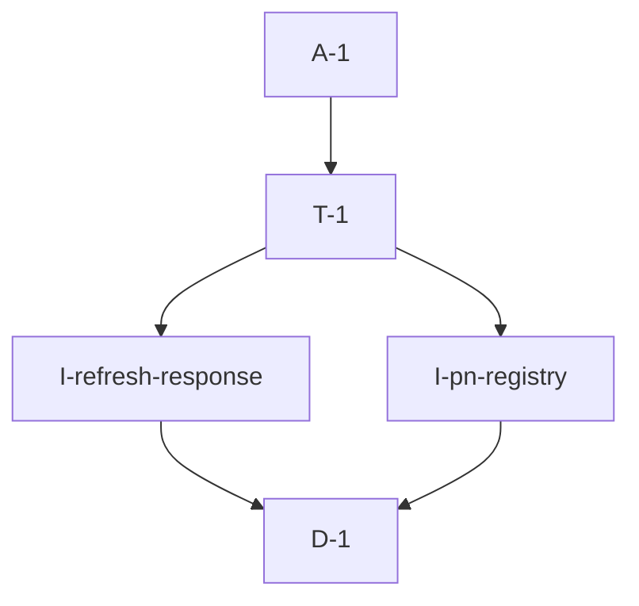

# Pipeline Plan

Risk profile: ./risk-profile.yaml

## Trigger
- Proposal: docs/versions/v0.1/modules/globals/012-restore-pn-reassignment-after-sn-restart/proposal.md
- User launch confirmed: yes
- User launch statement: 确认扩展 011
- Launch stage: proposal
- First auto stage: design
- Design source: pipeline/plan.md
- Per-stage user confirmation: skipped by the user's confirmation of the displayed 011 expansion and continued automatic completion
- Auto-confirm completed document stages: no design/testing Markdown documents generated; acceptance report is validated at completion
- Auto-pipeline document policy: stage-selective; no automatic design/testing Markdown; testplan.yaml required for automatic testing
- Version: v0.1
- Packet module: globals
- Task name: 012-restore-pn-reassignment-after-sn-restart
- Target module(s): vpn-frame, bucky-vpn
- change_id values: CHG-apply-equal-version-pn-refresh, CHG-reconnect-reappeared-pn

## Acceptance Baseline
- Final acceptance is judged against the launch-confirmed `proposal.md`, the user-confirmed expansion of task 011, and this automatic-design mapping.

## Stage Graph
| Task ID | Stage | Execution Mode | Responsibility | Scope | Parent Task | Depends On | Output | Done Condition |
|---------|-------|----------------|----------------|-------|-------------|------------|----------------|
| D-1 | design | auto-pipeline | map equal-version response application and PN registry lifecycle across the two client modules | bound cross-module task packet | root | none | complete pipeline-plan mappings and risk checks | plan, scope bindings, state ownership, failure flows, and risk profile validate |
| I-refresh-response | implementation | auto-pipeline | make response content participate in the unchanged-response decision without weakening commit-after-success | vpn-frame client refresh | root | D-1 | updated vpn_client.rs | non-empty equal-version responses reconcile; empty equal-version responses remain no-op |
| I-pn-registry | implementation | auto-pipeline | remove stale PN registry entries and reconnect identical reappearing PN metadata | bucky-vpn P2P PN synchronization | root | D-1 | updated p2p_vpn.rs | remove/re-add reaches connect_server again and failure remains retryable |
| T-1 | testing | auto-pipeline | derive and run red-green version-collision, registry lifecycle, focused tests, and compile closure | delivered vpn-frame and bucky-vpn code | root | I-refresh-response, I-pn-registry | testplan.yaml, regression tests, runtime coverage, and test-run artifact | both change IDs and all required risk checks have evidence or a concrete platform gap |
| A-1 | acceptance | auto-pipeline | independently falsify restart recovery, implementation, tests, and 011 follow-up consistency | complete delivery | root | T-1 | acceptance-report.md and final runtime state | accepted report and complete pipeline exit checks |

## Submodule Tasks
| Task ID | Stage | Execution Mode | Responsibility | Submodule | Parent Task | Depends On | Output | Done Condition |
|---------|-------|----------------|----------------|-----------|-------------|------------|----------------|

No deeper submodule tasks are created. The two independent implementation owners are already represented by `I-refresh-response` and `I-pn-registry`; testing consumes both together as one restart-recovery behavior.

## Parallel Scheduling
- Strategy: dependency-ready-set
- Concurrency: use runtime-available child-agent slots when dependencies permit.
- Shared artifact owner: parent-orchestrator
- Coordination: practical edit coordination treats the two implementation tasks as dependency-independent because they modify separate project modules; the current parent executes both in one wave and backfills available capacity, without sub-agent delegation because the session instruction reserves sub-agents for an explicit user or repository mandate.
- Lock directory: `.harness/locks/`
- Serialization reasons: explicit dependency, edit coordination, or exhausted concurrency capacity only.
- Evidence: automatic task launches and dependency-ready waves are recorded under `.harness/pipelines/v0.1/globals/012-restore-pn-reassignment-after-sn-restart/state.json`.

## Dependency Graphs


Arrows point from each dependent task to its prerequisite.

| Level | Parent | Node | Depends On |
|-------|--------|------|------------|
| pipeline-task | root | D-1 | none |
| pipeline-task | root | I-refresh-response | D-1 |
| pipeline-task | root | I-pn-registry | D-1 |
| pipeline-task | root | T-1 | I-refresh-response, I-pn-registry |
| pipeline-task | root | A-1 | T-1 |

## Exported Interfaces
| Interface | Owner | Consumer | Compatibility | Affected Callers | Migration Path |
|-----------|-------|----------|---------------|------------------|----------------|
| `VpnServerClient::get_vpn_info` result versions and VPN-info-list application contract | vpn-frame server/client boundary | `VpnClient::run_proc` / CHG-apply-equal-version-pn-refresh | backward-compatible | vpn-frame client runtime | keep the wire unchanged; interpret non-empty response content as authoritative even after restart-local version collision |
| `P2pVpnTunnelFactory::sync_pn_server_connections` registry invariant | bucky-vpn P2P tunnel factory | `VpnTunnelFactory::on_vpn_info_received` / CHG-reconnect-reappeared-pn | backward-compatible | bucky-vpn client runtime | keep types and call sites unchanged; align internal registry membership with actual TTP target removal |

## File-Level Interfaces
```rust
impl VpnClient<...> {
    async fn run_proc(self: &Arc<Self>) -> VpnResult<()>;
}

impl P2pVpnTunnelFactory {
    async fn sync_pn_server_connections(&self, vpn_infos: &[NodeVpnInfo]) -> VpnResult<()>;
}
```

No public signature or wire payload changes. The first method consumes `GetVpnInfo`; the second is invoked by `on_vpn_info_received` before response versions are committed.

## API and Build Surface Impact
- Public API impact: backward-compatible
- Crate-root export change: no
- Build-surface change: no
- Documentation examples affected: no
- Impact detail: behavior changes only in internal response reconciliation and PN connection registry lifecycle; the existing workspace dependency from `bucky-vpn` to `vpn-frame` is unchanged.

## Consumer Migration Closure
| Old Symbol | New Path | change_id | Consumer Path | Consumer Kind | Migration Status |
|------------|----------|-----------|---------------|---------------|------------------|
| not-applicable | not-applicable | CHG-apply-equal-version-pn-refresh | vpn-frame/src/client/vpn_client.rs | existing internal consumer | verified-no-signature-change |
| not-applicable | not-applicable | CHG-reconnect-reappeared-pn | vpn-client/src/p2p_vpn.rs | existing internal consumer | verified-no-signature-change |

## State Ownership
| State | Owner | Access Interface | Lifecycle | Failure Transitions |
|-------|-------|------------------|-----------|---------------------|
| applied VPN and PN versions plus first-sync marker | `VpnClient` | `run_proc` request/response/application path | read before polling; equal versions short-circuit only for an empty response; committed only after routes, PN connections, and devices apply | any application failure retains old versions/first-sync state so the next poll requests and reapplies the full update |
| desired and registered PN target map | `P2pVpnTunnelFactory` | `sync_pn_server_connections` | take registry under mutex, remove no-longer-desired TTP targets and registry entries, connect missing desired PN targets, restore registry | remove failure is logged but the logical entry is removed so reappearance retries; connect failure returns before false connected state is committed and the next uncommitted response retries |

## Failure Flows
| Flow | Boundary | Failure | Handling |
|------|----------|---------|----------|
| restart-local PN version collision | SN GetVpnInfo response to vpn-frame client | non-empty response has the same numeric versions cached before restart | process the payload because content is non-empty; keep the empty equal-version response as the only fast path |
| PN temporarily absent then identical PN returns | vpn-frame response to bucky-vpn PN registry | removed target remains in registry and suppresses reconnect | delete the logical registry entry when removing its targets; reappearance is missing and therefore invokes connect_server |
| reconnecting reappeared PN | bucky-vpn tunnel factory to P2P TTP client | every endpoint connection attempt fails | return the existing VpnError before response-version commit; do not record the PN as connected; retry on the next poll |
| unchanged incremental poll | SN response to vpn-frame client | empty response could be mistaken for an authoritative empty network set | short-circuit only when response is empty and both versions match; never reconcile an unchanged empty response |

## Rejected Alternatives
| Decision Type | Selected | Rejected | Reason |
|---------------|----------|----------|--------|
| boundary | fix response consumption in vpn-frame and actual target ownership in bucky-vpn | change server persistence/version schema | the server already returns `pn_changed_now` content and the client owns discarding it; no data migration is needed |
| technical | use response emptiness plus versions for fast-path selection | delete the version fast path entirely or trust versions alone | deleting it would treat the incremental empty list as network removal, while trusting versions reproduces restart collision loss |
| technical | remove stale map entries when TTP targets are removed | retain entries with an additional disconnected flag | registry membership already represents connected/registered targets; another state flag adds unnecessary divergence |
| collaboration | implement the two independent file changes in one parent-coordinated wave, then integrate tests | serialize them as if one code interface depended on the other | their production edits are independent; only combined testing depends on both |

## Implementation Scope Bindings
| change_id | target_module | proposal_id | design_coverage | scope_paths | design_rules_applied |
|-----------|---------------|-------------|-----------------|-------------|----------------------|
| CHG-apply-equal-version-pn-refresh | vpn-frame | P-001 | gate unchanged responses on both equal versions and empty content, preserving full application and final commit ordering for non-empty responses | `vpn-frame/src/client/vpn_client.rs` | protocol boundary, restart lifecycle, state owner, retry ordering, compatibility, failure flow |
| CHG-reconnect-reappeared-pn | bucky-vpn | P-002 | remove no-longer-desired PN keys from the taken registry after target removal so identical reappearance enters the existing connect path | `vpn-client/src/p2p_vpn.rs` | cross-module lifecycle, registry invariant, error retry, mutex/await boundary, compatibility |

## File-Level Implementation Sequence
| Sequence | Task ID | File-Level Module | Action | Depends On | change_id | target_module | Scope Paths | Context Sources |
|----------|---------|-------------------|--------|------------|-----------|---------------|-------------|-----------------|
| 1 | I-refresh-response | `vpn-frame/src/client/vpn_client.rs` | change the equal-version fast path to require an empty response and add focused regression coverage | none | CHG-apply-equal-version-pn-refresh | vpn-frame | `vpn-frame/src/client/vpn_client.rs` | proposal P-001, GetVpnInfo server behavior, task 011 commit ordering |
| 2 | I-pn-registry | `vpn-client/src/p2p_vpn.rs` | remove stale connected keys alongside TTP target removal and add remove/re-add lifecycle coverage | none | CHG-reconnect-reappeared-pn | bucky-vpn | `vpn-client/src/p2p_vpn.rs` | proposal P-002, current desired/connected synchronization, endpoint connect path |

## Return Rules
- Proposal ambiguity or incorrect restart-recovery acceptance boundary stops for user decision.
- Incorrect response-content, registry-state, retry, concurrency, or compatibility mapping returns to D-1.
- A missed payload, false connected entry, reconnect suppression, or compile defect returns to the owning implementation task.
- Missing red-green collision/remove-readd coverage or task-scoped evidence returns to T-1.
- The same unresolved issue stops after more than five unsuccessful return iterations.

## Exit Conditions
- A non-empty equal-version PN refresh is consumed and reaches route/connection/device reconciliation.
- An empty equal-version incremental response remains a no-op.
- Removing and re-adding identical PN metadata invokes a fresh `connect_server` attempt without restarting vpn-client.
- Connection/application failures leave state retryable and versions uncommitted.
- Focused regression tests and compile closure pass for vpn-frame and bucky-vpn with task-scoped evidence.
- Final acceptance report is accepted with no blocking findings.
