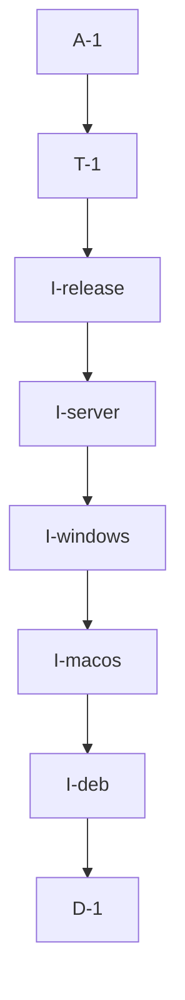

# Pipeline Plan

## Trigger
- Proposal: docs/versions/v0.1/modules/globals/017-add-github-actions-builds/proposal.md
- User launch confirmed: yes
- User launch statement: `确认，自动完成`
- Launch stage: proposal
- First auto stage: design
- Design source: pipeline/plan.md
- Per-stage user confirmation: skipped by explicit user auto-pipeline authorization
- Auto-confirm completed document stages: automatic design/testing produce no design.md or testing.md; acceptance report is validated at completion
- Auto-pipeline document policy: stage-selective; no automatic design/testing Markdown; testplan.yaml required for automatic testing
- Version: v0.1
- Packet module: globals
- Task name: 017-add-github-actions-builds
- Target module(s): bucky-vpn, bucky-vpn-server
- change_id values: CHG-github-deb-build, CHG-github-macos-build, CHG-github-windows-build, CHG-github-server-build, CHG-github-release

## Acceptance Baseline
- Final acceptance is judged against the launch-confirmed `proposal.md`.

## Stage Graph
| Task ID | Stage | Execution Mode | Responsibility | Scope | Parent Task | Depends On | Output | Done Condition |
|---------|-------|----------------|----------------|-------|-------------|------------|--------|----------------|
| D-1 | design | auto-pipeline | define version ownership, platform jobs, publication gates, interfaces, failures, and implementation order | all five change ids | root | none | pipeline plan mappings and risk checks | structural plan validation passes without design.md |
| I-deb | implementation | auto-pipeline | derive the client Cargo version for Debian packaging and add its Linux workflow job | Debian script, metadata, package output, and workflow handoff | root | D-1 | version-aligned Debian entrypoint and job | package version/filename align and final `.deb` is checked before artifact upload |
| I-macos | implementation | auto-pipeline | derive the client Cargo version for macOS packaging and add its macOS workflow job | macOS script, universal package output, and workflow handoff | root | I-deb | version-aligned macOS entrypoint and job | both targets build and final `.pkg` is checked before artifact upload |
| I-windows | implementation | auto-pipeline | derive the client Cargo version for Windows packaging and add its Windows workflow job | batch script, Inno Setup metadata, installer output, and workflow handoff | root | I-macos | version-aligned Windows entrypoint and job | Cargo version reaches ISCC and final installer is checked before artifact upload |
| I-server | implementation | auto-pipeline | add server build verification and matching-Tag GHCR publication | server script inputs, Docker image, permissions, and registry tags | root | I-windows | server job and Tag-gated GHCR publisher | ordinary CI only validates; matching Tag pushes version and latest to one image digest |
| I-release | implementation | auto-pipeline | add matching-Tag GitHub Release publication | version guard, client artifacts, automatic source archives, and release permissions | root | I-server | Tag-gated Release job | mismatch fails before mutation and matching Tag attaches exactly three installer classes |
| T-1 | testing | auto-pipeline | derive and implement task-scoped contract validation from proposal, plan, and delivered files | workflow, scripts, metadata, permissions, events, versions, and artifact paths | root | I-release | focused tests, runner registration, testplan, runtime evidence | task-scoped all run passes and covers every change id plus required risk checks |
| A-1 | acceptance | auto-pipeline | independently falsify requirements, design, implementation, and test adequacy | complete delivery and recorded remote-execution gaps | root | T-1 | `acceptance-report.md` and final runtime state | no blocking defect remains and report/checkers accept the delivery |

## Submodule Tasks
| Task ID | Stage | Execution Mode | Responsibility | Submodule | Parent Task | Depends On | Output | Done Condition |
|---------|-------|----------------|----------------|-----------|-------------|------------|--------|----------------|

## Parallel Scheduling
- Strategy: dependency-ready-set
- Concurrency: use all runtime-available child-agent slots and immediately backfill available capacity with useful dependency-ready work.
- Shared artifact owner: parent-orchestrator
- Coordination: practical edit coordination keeps `.github/workflows/build.yml`, task metadata, testplan, runner registration, and runtime state integrated by the parent without treating paths as permissions.
- Lock directory: `.harness/locks/`
- Serialization reasons: explicit dependency, edit coordination, or exhausted concurrency capacity only; platform steps are serialized because they incrementally integrate the shared workflow, T-1 depends on the delivered workflow, and A-1 depends on test evidence.
- Evidence: automatic task launches are recorded under `.harness/pipelines/v0.1/globals/017-add-github-actions-builds/state.json`.

## Dependency Graphs

| Level | Parent | Node | Depends On |
|-------|--------|------|------------|
| pipeline-task | root | D-1 | none |
| pipeline-task | root | I-deb | D-1 |
| pipeline-task | root | I-macos | I-deb |
| pipeline-task | root | I-windows | I-macos |
| pipeline-task | root | I-server | I-windows |
| pipeline-task | root | I-release | I-server |
| pipeline-task | root | T-1 | I-release |
| pipeline-task | root | A-1 | T-1 |

## Exported Interfaces
| Interface | Owner | Consumer | Compatibility | Affected Callers | Migration Path |
|-----------|-------|----------|---------------|------------------|----------------|
| `cargo metadata --no-deps --format-version 1` package-version lookup for `bucky-vpn` | client packaging entrypoints | `build_deb.sh`, `build_macos.sh`, `build_win.bat`, GitHub Actions release validation | backward-compatible | repository build users and release workflow | existing build commands remain unchanged while hard-coded 1.2.0/1.2 constants are replaced by exact `bucky-vpn` version lookup |
| package output paths reported by each client build entrypoint | platform packaging scripts | GitHub Actions artifact and Release steps | backward-compatible | local packagers and CI workflow | retain existing naming shapes while substituting the Cargo-derived version |
| matching `v` plus client package version Tag publication contract | GitHub Actions workflow | repository maintainers and release consumers | new | CHG-github-release | push a `v`-prefixed exact client package version; mismatch fails before Release or GHCR mutation |
| versioned `ghcr.io/buckyos/bucky-vpn-server` tag and `latest` | GitHub Actions workflow | server image consumers | new | CHG-github-server-build | pull the immutable product-version tag for deployments; latest remains a convenience alias |

## API and Build Surface Impact
- Public API impact: none
- Crate-root export change: no
- Build-surface change: yes
- Documentation examples affected: no

## Consumer Migration Closure
| Old Symbol | New Path | change_id | Consumer Path | Consumer Kind | Migration Status |
|------------|----------|-----------|---------------|---------------|------------------|
| `build_deb.sh` hard-coded `1.2.0` filename and `vpn_deb/DEBIAN/control` `1.2` | `vpn-client/Cargo.toml` package.version via strict build-script lookup | CHG-github-deb-build | `build_deb.sh` | packaging entrypoint | migrated |
| `build_macos.sh` hard-coded `VERSION=1.2.0` | `vpn-client/Cargo.toml` package.version via strict build-script lookup | CHG-github-macos-build | `build_macos.sh` | packaging entrypoint | migrated |
| `build_win.bat` and `install.iss` hard-coded `1.2.0` | Cargo-derived `AppVersion` command-line define passed to Inno Setup | CHG-github-windows-build | `build_win.bat` | packaging entrypoint | migrated |
| local-only `bucky-vpn-server:latest` image | matching-Tag promotion to versioned and latest GHCR tags | CHG-github-server-build | `.github/workflows/build.yml` | build and publication consumer | migrated |
| no GitHub Release workflow | matching-Tag release with installer assets and automatic source archives | CHG-github-release | `.github/workflows/build.yml` | release consumer | migrated |

## State Ownership
| State | Owner | Access Interface | Lifecycle | Failure Transitions |
|-------|-------|------------------|-----------|---------------------|
| product release version | `vpn-client/Cargo.toml` `bucky-vpn` package | strict Cargo metadata lookup | committed version is read by all client packages and publishers | missing/duplicate/unsupported value fails the affected build before packaging |
| workflow build artifacts | individual platform build jobs | GitHub Actions artifacts | created per run, downloaded by release job on matching Tags, then expire per repository policy | missing expected file fails its job and prevents release |
| GitHub Release | Tag-gated release job | `gh release create` with repository token | absent to published only after matching Tag and all dependencies pass | any validation/build/upload failure leaves no successful Release conclusion |
| GHCR image tags | Tag-gated server publisher | Docker registry using repository token | validated local image is tagged with version and latest and pushed | login/tag/push failure fails publication; ordinary events never enter this state |
| pipeline execution state | parent orchestrator | `.harness/pipelines/v0.1/globals/017-add-github-actions-builds/state.json` | pending to running to complete | defects return to design, implementation, or testing and record an iteration |

## Failure Flows
| Flow | Boundary | Failure | Handling |
|------|----------|---------|----------|
| version discovery | packaging script to Cargo workspace metadata | package missing, duplicate match, invalid semver for a target packager, or Cargo failure | exit non-zero before modifying package metadata or producing a misleading artifact |
| Debian packaging | Rust musl build to dpkg-deb | target/tool missing, binary absent, or control metadata version mismatch | fail the Debian job and do not upload an artifact |
| macOS packaging | dual Rust targets to lipo/pkgbuild | architecture binary, resource, or package tool missing | fail the macOS job and do not upload an artifact |
| Windows packaging | Cargo build to Inno Setup | ISCC unavailable, version argument absent/invalid, or installer missing | fail the Windows job and do not upload an artifact |
| server image assembly | musl server and Flutter Web build to Docker | either input build or Docker image inspection fails | fail the server job; no registry login/push on ordinary events |
| release validation | pushed Tag to Cargo product version | Tag is absent or differs from the `v`-prefixed exact product version | fail before release and GHCR publication steps |
| Release promotion | Actions artifacts to GitHub Release | dependency artifact missing, duplicate Release, or upload failure | fail the release job without fabricating a successful publication; rerun policy must not silently overwrite unrelated assets |
| GHCR promotion | validated local image to registry | token lacks package permission or registry push fails | fail image publication and expose the digest/push error; never fall back to a personal token |

## Rejected Alternatives
| Decision Type | Selected | Rejected | Reason |
|---------------|----------|----------|--------|
| boundary | `vpn-client/Cargo.toml` owns the shared product version | Tag-only or root VERSION ownership | the user explicitly selected the client Cargo package version and it binds the source being packaged |
| technical | platform jobs invoke repository build entrypoints and use Actions artifacts for cross-job promotion | duplicate packaging commands entirely in YAML | one packaging implementation prevents local and CI behavior from drifting |
| technical | GitHub automatic source ZIP/tar.gz | custom source bundle Release assets | the user explicitly accepted GitHub archives and no generated/full-history source bundle is required |
| collaboration | serialize packaging-interface changes before shared workflow assembly | independent concurrent edits to `.github/workflows/build.yml` | the workflow consumes all script output contracts and is the single shared integration point |

## Implementation Scope Bindings
| change_id | target_module | proposal_id | design_coverage | scope_paths | design_rules_applied |
|-----------|---------------|-------------|-----------------|-------------|----------------------|
| CHG-github-deb-build | bucky-vpn | P-001 | Cargo-owned version lookup, temporary Debian metadata update, musl build, package output verification, and Linux artifact handoff | `.github/workflows/build.yml`, `build_deb.sh`, `vpn_deb/DEBIAN/control`, `vpn-client/Cargo.toml` | version ownership, migration closure, failure-before-artifact, platform boundary |
| CHG-github-macos-build | bucky-vpn | P-002 | Cargo-owned version lookup, dual-target build, universal binary, pkgbuild, and macOS artifact handoff | `.github/workflows/build.yml`, `build_macos.sh`, `vpn-client/Cargo.toml` | version ownership, migration closure, failure-before-artifact, platform boundary |
| CHG-github-windows-build | bucky-vpn | P-003 | Cargo-owned version lookup, native client build, Inno Setup define override, and Windows artifact handoff | `.github/workflows/build.yml`, `build_win.bat`, `install.iss`, `vpn-client/Cargo.toml` | version ownership, migration closure, failure-before-artifact, platform boundary |
| CHG-github-server-build | bucky-vpn-server | P-004 | musl server build, Flutter Web bundle, Docker assembly/inspection, and matching-Tag GHCR promotion | `.github/workflows/build.yml`, `build_server.sh`, `Dockerfile` | build dependency ordering, least privilege, event gate, digest identity |
| CHG-github-release | bucky-vpn | P-005 | matching-Tag guard, dependency artifact aggregation, installer-only asset upload, and automatic GitHub source archives | `.github/workflows/build.yml`, `vpn-client/Cargo.toml` | Tag/version contract, least privilege, publication failure flow |

## File-Level Implementation Sequence
| Sequence | Task ID | File-Level Module | Action | Depends On | change_id | target_module | Scope Paths | Context Sources |
|----------|---------|-------------------|--------|------------|-----------|---------------|-------------|-----------------|
| 1 | I-deb | Debian packaging and Linux job | derive strict Cargo version, stage transient control metadata, build package, verify output, and upload CI artifact | none | CHG-github-deb-build | bucky-vpn | `.github/workflows/build.yml`, `build_deb.sh`, `vpn_deb/DEBIAN/control`, `vpn-client/Cargo.toml` | proposal P-001, version interface, Debian failure flow |
| 2 | I-macos | macOS packaging and job | derive strict Cargo version, build universal package, verify output, and upload CI artifact | I-deb | CHG-github-macos-build | bucky-vpn | `.github/workflows/build.yml`, `build_macos.sh`, `vpn-client/Cargo.toml` | proposal P-002, version interface, macOS failure flow |
| 3 | I-windows | Windows packaging and job | derive strict Cargo version, pass it into Inno Setup, verify output, and upload CI artifact | I-macos | CHG-github-windows-build | bucky-vpn | `.github/workflows/build.yml`, `build_win.bat`, `install.iss`, `vpn-client/Cargo.toml` | proposal P-003, version interface, Windows failure flow |
| 4 | I-server | server image build and GHCR job | invoke server entrypoint, inspect image, gate registry login, and publish version plus latest tags | I-windows | CHG-github-server-build | bucky-vpn-server | `.github/workflows/build.yml`, `build_server.sh`, `Dockerfile` | proposal P-004, server failure flow, permissions and digest checks |
| 5 | I-release | GitHub Release job | validate matching Tag, aggregate exactly three client artifacts, and create Release using automatic source archives | I-server | CHG-github-release | bucky-vpn | `.github/workflows/build.yml`, `vpn-client/Cargo.toml` | proposal P-005, release failure flow and source-archive boundary |

## Return Rules
- Proposal ambiguity or an incorrect acceptance boundary stops the pipeline for user decision.
- Missing/wrong version ownership, workflow architecture, permissions, or publication failure handling returns to D-1.
- A packaging-script, workflow, Release, or GHCR delivery defect against this plan returns to its matching I-deb, I-macos, I-windows, I-server, or I-release task.
- Missing, weak, or non-runnable task evidence returns to T-1.
- Platform jobs not executable from this local environment remain explicit external evidence gaps; they do not become invented pass results.
- The same unresolved issue stops after more than five unsuccessful return iterations.

## Exit Conditions
- All proposal outcomes and risk-profile required checks are mapped to the delivered workflow and task test evidence.
- The task-scoped unified test run succeeds for every change id.
- Workflow and scripts pass focused static/contract validation, and every unexecuted hosted platform is explicitly recorded.
- Stage scope checks pass for the task delivery.
- Final acceptance report is accepted with residual remote first-Tag execution risk stated accurately.
