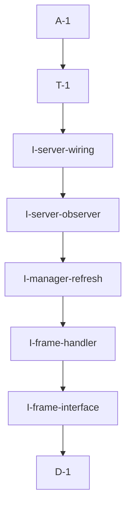

# Pipeline Plan

Risk profile: ./risk-profile.yaml

## Trigger
- Proposal: docs/versions/v0.1/modules/globals/027-refresh-pn-observation-on-reonline/proposal.md
- User launch confirmed: yes
- User launch statement: `确认，自动完成`
- Launch stage: proposal
- First auto stage: design
- Design source: pipeline/plan.md
- Per-stage user confirmation: skipped by explicit user auto-pipeline authorization
- Auto-confirm completed document stages: no design/testing Markdown documents generated; acceptance report is validated at completion
- Auto-pipeline document policy: stage-selective; no automatic design/testing Markdown; testplan.yaml required for automatic testing
- Version: v0.1
- Packet module: globals
- Task name: 027-refresh-pn-observation-on-reonline
- Target module(s): vpn-frame, bucky-vpn-server
- change_id values: CHG-observe-pn-heartbeat-tunnel, CHG-refresh-pn-observation-on-reonline

## Acceptance Baseline
- Final acceptance is judged against the launch-confirmed `proposal.md` and this automatic-design mapping.

## Stage Graph
| Task ID | Stage | Execution Mode | Responsibility | Scope | Parent Task | Depends On | Output | Done Condition |
|---------|-------|----------------|----------------|-------|-------------|------------|--------|----------------|
| D-1 | design | auto-pipeline | map cmd158 tunnel observation, selector compatibility, PN state merge, liveness, and failure boundaries | bound globals task packet | root | none | complete pipeline-plan mappings and risk checks | plan, scope bindings, interfaces, state ownership, failure flows, and risk profile validate without design.md |
| I-frame-interface | implementation | auto-pipeline | add the optional tunnel observer, additive selector behavior, and compatible VpnServer construction | vpn-frame server interfaces | root | D-1 | updated vpn_server.rs | existing constructors/selectors remain compatible and production can inject an observer |
| I-frame-handler | implementation | auto-pipeline | pass exact cmd158 tunnel context into observed-heartbeat handling | vpn-frame PN control handler | root | I-frame-interface | updated pn_control_server.rs | cmd158 observes its tunnel before applying heartbeat and preserves failure semantics |
| I-manager-refresh | implementation | auto-pipeline | atomically merge a fresh observation with cmd158 state and remove disconnect-generation cleanup | PN server manager lifecycle | root | I-frame-handler | updated pn_server_manager.rs | re-online heartbeat uses fresh observation, TTL controls liveness, and no disconnect cleanup API remains |
| I-server-observer | implementation | auto-pipeline | resolve the exact command tunnel remote endpoint and remove disconnect listener behavior | concrete PN command service | root | I-manager-refresh | updated pn_control_server.rs | exact tunnel remote endpoint is returned without retaining a writer guard; disconnect listener is absent |
| I-server-wiring | implementation | auto-pipeline | inject the concrete observer into VpnServer startup | SN production startup | root | I-server-observer | updated main.rs | production cmd158 handler receives the exact-tunnel observer |
| T-1 | testing | auto-pipeline | derive and run handler, same-session recovery, reconnect/address-change, multi-tunnel, observation-failure, compatibility, and compile verification | delivered cross-module code | root | I-server-wiring | testplan.yaml, focused tests, runtime coverage, and task-run artifact | both change ids and every applicable risk check have passing evidence or a concrete environment gap |
| A-1 | acceptance | auto-pipeline | independently falsify requirement, design, concurrency, liveness, compatibility, and test claims and close or return defects | complete delivery | root | T-1 | acceptance-report.md and final runtime state | report is accepted and pipeline exit checks pass |

## Submodule Tasks
| Task ID | Stage | Execution Mode | Responsibility | Submodule | Parent Task | Depends On | Output | Done Condition |
|---------|-------|----------------|----------------|-----------|-------------|------------|--------|----------------|

No deeper submodule tasks are created. The cross-project packet is already split into a shared handler contract and concrete server state/transport work; further nesting would duplicate file-level ownership.

## Parallel Scheduling
- Strategy: dependency-ready-set
- Concurrency: use runtime-available child-agent slots when dependencies permit; this task's dependency graph keeps the production edit tasks serial.
- Shared artifact owner: parent-orchestrator
- Coordination: practical edit coordination implements the additive shared contract before its manager and concrete-server consumers; at each scheduling point, available capacity is considered for dependency-ready work.
- Lock directory: `.harness/locks/`
- Serialization reasons: explicit dependency, edit coordination, or exhausted concurrency capacity only.
- Evidence: automatic task launches are recorded under `.harness/pipelines/v0.1/globals/027-refresh-pn-observation-on-reonline/state.json`.

## Dependency Graphs


Arrows point from each dependent task to its prerequisite.

| Level | Parent | Node | Depends On |
|-------|--------|------|------------|
| pipeline-task | root | D-1 | none |
| pipeline-task | root | I-frame-interface | D-1 |
| pipeline-task | root | I-frame-handler | I-frame-interface |
| pipeline-task | root | I-manager-refresh | I-frame-handler |
| pipeline-task | root | I-server-observer | I-manager-refresh |
| pipeline-task | root | I-server-wiring | I-server-observer |
| pipeline-task | root | T-1 | I-server-wiring |
| pipeline-task | root | A-1 | T-1 |

## Exported Interfaces
| Interface | Owner | Consumer | Compatibility | Affected Callers | Migration Path |
|-----------|-------|----------|---------------|------------------|----------------|
| optional PN control tunnel endpoint observer | `vpn-frame::server::VpnServer` / `PnControlServer` | `vpn-server/src/main.rs` | backward-compatible | new production constructor call only | preserve the existing constructor with no observer and add an observer-aware constructor for the SN production wiring |
| observed-heartbeat selector operation with a default fallback | `vpn-frame::server::PnServerSelector` | cmd158 handler and `PnServerManager` | backward-compatible | existing selector implementers use the default method | default delegates to the existing `report_heartbeat`; `PnServerManager` overrides to merge optional observation first |
| exact command tunnel endpoint resolver | `vpn-server/src/pn_control_server.rs` | vpn-frame observer interface | new | `vpn-server/src/main.rs` | wrap the concrete command service and match both peer and `TunnelId` before reading `SnTunnelWrite::remote()` |

## File-Level Interfaces
```rust
#[async_trait]
pub trait PnControlTunnelObserver: Send + Sync + 'static {
    async fn observe(&self, peer_id: &NodeId, tunnel_id: TunnelId) -> VpnResult<Option<PnServerInfo>>;
}

#[async_trait]
pub trait PnServerSelector {
    async fn report_heartbeat_with_observation(
        &self,
        pn_node_id: &NodeId,
        heartbeat: &ProxyNodeHeartbeat,
        observation: Option<&PnServerInfo>,
    ) -> VpnResult<()>;
}
```

The names may be adjusted to local style during implementation, but the semantics, ordering, default compatibility, and exact-tunnel boundary are fixed.

## API and Build Surface Impact
- Public API impact: backward-compatible
- Crate-root export change: no
- Build-surface change: no
- Documentation examples affected: no
- Impact detail: additive server-side traits/constructors are internal to existing exports; cmd158 encoding, command number, Cargo dependencies/features, configuration, and client response structures do not change.

## State Ownership
| State | Owner | Access Interface | Lifecycle | Failure Transitions |
|-------|-------|------------------|-----------|---------------------|
| cmd158 reported protocols, mapped ports, optional reported addresses, and last heartbeat | `RemotePnServerState` in `PnServerManager` | observed-heartbeat selector operation | created/updated by cmd158; expires only by remote heartbeat TTL | timeout logs one offline transition and excludes selection; a later cmd158 resets liveness |
| last successfully observed public endpoint | `RemotePnServerState` in `PnServerManager` | observation supplied with cmd158 | refreshed from the exact current tunnel on every successful observation; retained while heartbeat is offline and replaced on later successful observation | missing/torn-down tunnel preserves the last valid observation but cannot extend heartbeat liveness; a new connection heartbeat replaces the IP |
| command tunnel remote endpoint | concrete `ProxyControlCmdService` connection writer | exact peer and tunnel lookup | exists while the command service registers that tunnel | tunnel disappearance returns no observation; no peer-level arbitrary fallback is allowed |
| merged current PN endpoints and selectable view | `PnServerManager` | merge, approval, heartbeat liveness, and endpoint filtering | recomputed when cmd158 supplies report plus optional fresh observation or when TTL is evaluated | no live heartbeat or no connectable endpoint excludes the PN |

## Key Call Flows
```mermaid
sequenceDiagram
  participant PN as Standalone PN
  participant Cmd as PN control command server
  participant Handler as cmd158 handler
  participant Manager as PnServerManager
  participant Client as VPN client info service

  PN->>Cmd: establish authenticated control connection
  PN->>Handler: cmd158 on tunnel_id T
  Handler->>Cmd: observe(peer_id, T)
  Cmd-->>Handler: remote_ep public IP
  Handler->>Manager: report heartbeat with observation
  Manager->>Manager: merge observed IP and mapped port, refresh TTL
  Client->>Manager: select live proxy nodes
  Manager-->>Client: connectable PN endpoint
  Note over Manager: heartbeat crosses TTL; log offline once, retain observation only as inactive history
  PN->>Handler: later cmd158 on current tunnel
  Handler->>Cmd: reobserve exact current tunnel
  Cmd-->>Handler: same or changed public IP
  Handler->>Manager: recovered heartbeat plus fresh observation
  Manager-->>Client: PN selectable with refreshed endpoint
```

## Failure Flows
| Flow | Boundary | Failure | Handling |
|------|----------|---------|----------|
| heartbeat expires while transport remains | manager TTL | PN is offline | retain last observation as inactive state, log offline once, exclude selection, and require a later cmd158 to restore liveness |
| control connection closes | command service | tunnel metadata disappears | do not mutate manager state from disconnect; TTL remains the liveness authority |
| cmd158 arrives on a reconnected changed-NAT tunnel | handler to observer | old observation is stale | exact tunnel lookup returns the new `remote_ep`, which replaces the old observation before report merge |
| tunnel disappears during cmd158 handling | handler to observer | no exact connection can be returned | log diagnostic, pass no new observation, preserve the last valid value, and apply heartbeat under existing connectable-endpoint rules |
| multiple peer connections exist | concrete observer | peer-level lookup is ambiguous | match `conn_id == tunnel_id`; never use the first/latest arbitrary peer connection |
| writer metadata is temporarily locked | concrete observer | observation waits behind a send | acquire only long enough to copy `remote()`, release before selector/manager await, and avoid lock-order inversion |

## Invariants to Preserve
- Heartbeat TTL is the sole PN online/offline authority; peer connection events do not change liveness.
- A fresh observed IP comes only from the exact authenticated tunnel carrying cmd158.
- Observation failure does not erase the last valid observation or create an unspecified endpoint.
- A PN is selectable only when approved, heartbeat-live, and represented by at least one connectable endpoint.
- Existing cmd158, client incremental PN list, approval, traffic accounting, and mapped-port semantics remain unchanged.
- The existing public VpnServer construction path and third-party/default selector implementations remain valid.

## Rejected Alternatives
| Decision Type | Selected | Rejected | Reason |
|---------------|----------|----------|--------|
| boundary | observe from the cmd158 handler using its exact tunnel id | observe only in the accept callback | accept does not rerun when heartbeats resume on an existing connection and cannot identify which tunnel carried a later heartbeat |
| boundary | let heartbeat TTL alone control online state | clear observation and liveness from peer disconnect callbacks | transport connection presence is not the existing PN online contract and introduces premature invalidation/races |
| technical | inject an observer and keep bottom command dependencies unchanged | modify `sfo-cmd-server` or `p2p-frame` APIs | the concrete service already exposes peer connections and `SnTunnelWrite::remote()`; dependency changes are unnecessary |
| technical | exact peer plus tunnel match | use any connection belonging to the peer | multiple PN control connections can have different NAT endpoints, so peer-only lookup can refresh the wrong address |
| technical | preserve last valid observation when exact lookup fails | overwrite observation with empty/unspecified data | a transient tunnel removal race must not recreate the online-with-empty-address failure |
| collaboration | implement the shared observer contract before manager and concrete server consumers | edit all cross-module call sites concurrently | ordered changes keep compile failures attributable and ensure consumers follow one stable interface |

## Implementation Scope Bindings
| change_id | target_module | proposal_id | design_coverage | scope_paths | design_rules_applied |
|-----------|---------------|-------------|-----------------|-------------|----------------------|
| CHG-observe-pn-heartbeat-tunnel | vpn-frame | P-001 | add the optional exact-tunnel observer, preserve constructor/selector compatibility, and invoke observed-heartbeat behavior from cmd158 | `vpn-frame/src/server/pn_control_server.rs`, `vpn-frame/src/server/vpn_server.rs`, `vpn-frame/tests/**` | interface consumer mapping, backward compatibility, exact command context, failure flow |
| CHG-refresh-pn-observation-on-reonline | bucky-vpn-server | P-002 | resolve exact command tunnel remote endpoint, refresh manager observation with heartbeat, remove disconnect cleanup, and wire production startup | `vpn-server/src/main.rs`, `vpn-server/src/pn_control_server.rs`, `vpn-server/src/pn_server_manager.rs`, `vpn-server/tests/**` | state ownership, runtime/security failure flow, lock lifetime, liveness separation, merge ordering |

## File-Level Implementation Sequence
| Sequence | Task ID | File-Level Module | Action | Depends On | change_id | target_module | Scope Paths | Context Sources |
|----------|---------|-------------------|--------|------------|-----------|---------------|-------------|-----------------|
| 1 | I-frame-interface | `vpn-frame/src/server/vpn_server.rs` | define the optional observer and additive observed-heartbeat selector behavior; preserve existing constructor and add observer-aware construction | none | CHG-observe-pn-heartbeat-tunnel | vpn-frame | `vpn-frame/src/server/vpn_server.rs` | proposal P-001, existing PnServerSelector defaults and VpnServer constructors |
| 2 | I-frame-handler | `vpn-frame/src/server/pn_control_server.rs` | retain cmd158 tunnel id, invoke observer, and pass optional observation to selector before response | I-frame-interface | CHG-observe-pn-heartbeat-tunnel | vpn-frame | `vpn-frame/src/server/pn_control_server.rs` | proposal P-001, cmd158 handler, observer failure semantics |
| 3 | I-manager-refresh | `vpn-server/src/pn_server_manager.rs` | override observed-heartbeat merge, retain observation across TTL without disconnect generation state, and remove immediate-disconnect cleanup APIs | I-frame-handler | CHG-refresh-pn-observation-on-reonline | bucky-vpn-server | `vpn-server/src/pn_server_manager.rs` | proposal P-002, reported/observed merge and selection predicate |
| 4 | I-server-observer | `vpn-server/src/pn_control_server.rs` | implement exact tunnel resolver, remove connection event listener and accept-time manager mutation, and copy remote endpoint without retaining writer guard | I-manager-refresh | CHG-refresh-pn-observation-on-reonline | bucky-vpn-server | `vpn-server/src/pn_control_server.rs` | proposal P-002, command connection registry, SnTunnelWrite::remote() |
| 5 | I-server-wiring | `vpn-server/src/main.rs` | construct and inject the concrete tunnel observer into VpnServer | I-server-observer | CHG-refresh-pn-observation-on-reonline | bucky-vpn-server | `vpn-server/src/main.rs` | production PN command service and selector wiring |

## Return Rules
- Proposal ambiguity or a changed liveness/compatibility boundary stops the pipeline for user decision.
- Incorrect observer ownership, exact-tunnel interface, state merge, or failure model returns to D-1.
- Wrong tunnel selection, stale disconnect cleanup, empty observation overwrite, lock-order risk, lost endpoint recovery, or compile failure returns to the owning implementation task.
- Missing handler, same-session, reconnect/address-change, multi-tunnel, failure, compatibility, or compile evidence returns to T-1.
- The same unresolved issue stops after more than five unsuccessful return iterations.

## Exit Conditions
- Every valid cmd158 attempts to observe the exact carrying tunnel before applying heartbeat state.
- A `report_local_address: false` PN that crosses heartbeat TTL becomes selectable after cmd158 resumes, using the current tunnel public IP and mapped port.
- Reconnect through a changed address replaces the old IP on the first valid cmd158; multiple tunnels never cross-contaminate observations.
- Disconnect alone neither clears observation nor changes online status; heartbeat TTL remains authoritative.
- Missing exact-tunnel metadata does not synthesize or erase an address and an addressless PN remains unselectable.
- Focused cross-module tests and affected-target compile closure pass without a wire, dependency, or breaking public API change.
- Final acceptance report is accepted with no blocking findings.
