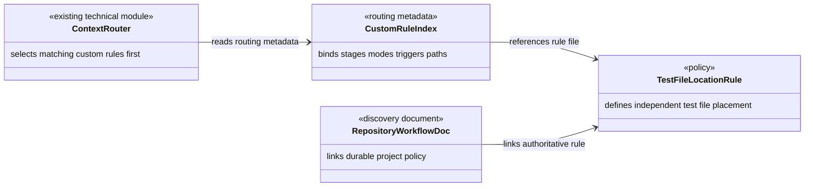
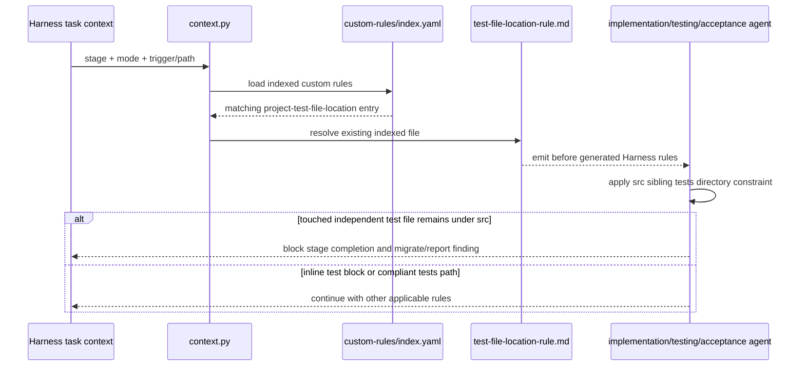

# 独立测试文件目录约束设计

Risk profile: ./risk-profile.yaml

## Design Scope
### Goals
- 在项目自定义规则层新增单一权威规则，定义独立测试文件的目录边界。
- 通过自定义规则索引让该规则在相关 implementation、testing、acceptance 上下文中优先于生成规则加载。
- 保持现有产品代码、构建行为和测试框架不变。

### Non-goals
- 不增加全仓 changed-path 扫描器或修改 `context.py` 的匹配算法。
- 不在 Design 阶段定义测试用例、测试命令或测试实现。
- 不迁移业务模块中未被当前任务触及的历史测试文件。

## Useful Context
- `harness/custom-rules/index.yaml` 是项目规则唯一激活入口，匹配的自定义规则优先于生成规则。
- `context.py` 已支持 `stages`、`modes`、`triggers` 和 `path_patterns`，无需新增路由能力。
- `vpn_web-no-new-tests-rule.md` 决定是否允许新增前端测试；本规则只在测试文件存在时约束其位置，两者职责不重叠。
- `docs/architecture/repository-workflow.md` 是项目规则的长期发现入口，本地治理规则要求同步更新。

## Overall Approach
新增一个 Markdown 自定义规则作为目录约束的唯一规范来源，再在自定义索引中登记一个 trigger 激活条目。索引覆盖根级 `src/**`、模块级 `*/src/**` 以及对应的 `tests` 路径，并限制在 implementation、testing、acceptance 阶段和两种执行模式。现有 `context.py` 继续负责读取索引、匹配上下文并按自定义规则优先级输出，不修改其实现。

## Layered Design Document Index
| level | parent_document | unit | design_document | responsibility |
|-------|-----------------|------|-----------------|----------------|
| root | `design.md` | `repo-governance/014-test-file-location-rule` | `design.md` | 定义规则、索引和现有路由器之间的整体关系与实现顺序 |

not-applicable: 本任务是一个内聚的仓库策略条目，没有需要独立设计文档的业务子模块或嵌套子模块。

## Module Relationship UML


依赖方向为现有路由器读取索引、索引引用规则、治理说明链接规则；新规则不反向依赖路由器实现，不形成环。

## File-Level Interfaces
`harness/custom-rules/index.yaml` 增加下列兼容条目形状；现有字段集合和 schema version 不变：

```yaml
rules:
  - id: project-test-file-location
    file: harness/custom-rules/test-file-location-rule.md
    activation: trigger
    tiers: [high-risk, standard, trivial]
    stages: [implementation, testing, acceptance]
    modes: [manual, auto-pipeline]
    triggers: [test, testing]
    path_patterns: ["src/**", "*/src/**", "tests/**", "*/tests/**"]
```

- Consumer: `harness/scripts/context.py` / `CHG-enforce-test-file-location`
- Compatibility: backward-compatible
- Compatibility note: 只新增一个索引条目，不改变已有条目或路由 schema。

`harness/custom-rules/test-file-location-rule.md` 提供供 Agent 消费的规范章节：目标、适用范围、定义、强制规则、阶段处理、允许边界和 Review 指引。它不暴露代码 API。

## API and Build Surface Impact
- Public API impact: none
- Crate-root export change: no
- Build-surface change: no
- Documentation examples affected: no

## Consumer Migration Closure
not-applicable: 没有 breaking/migration-required API、crate-root export 或 build-surface 变更。

## Key Flows


## State and Ownership
not-applicable: 本任务不新增持久数据、共享可变状态或生命周期状态机；版本化 Markdown 规则和 YAML 索引是唯一配置来源。

## Directly Mapped Change Items
| change_id | target_module | proposal_id | Design Coverage | Scope Paths | Interface / Boundary Impact | Notes |
|-----------|---------------|-------------|-----------------|-------------|-----------------------------|-------|
| CHG-enforce-test-file-location | repo-governance | P-001 | `Overall Approach`、`Module Relationship UML`、`File-Level Interfaces`、`Key Flows` | `harness/custom-rules/test-file-location-rule.md`, `harness/custom-rules/index.yaml` | 新增项目规则合同与路由条目；不改变路由器、产品或构建接口 | 治理文档同步属于 Design 工件；测试实现和入口登记由后续 Testing 阶段负责 |

## Implementation Order
| Phase | Goal | Depends On | Output |
|-------|------|------------|--------|
| 1 | 建立目录约束的唯一权威规则文本 | approved design | `test-file-location-rule.md` |
| 2 | 将规则登记到项目自定义索引并启用上下文路由 | phase 1 | `harness/custom-rules/index.yaml` 新条目 |

## File-Level Implementation Sequence
| sequence | file_level_module | action | depends_on | change_id | scope_path | implementation_task |
|----------|-------------------|--------|------------|-----------|------------|---------------------|
| 1 | `harness/custom-rules/test-file-location-rule.md` | create | none | CHG-enforce-test-file-location | `harness/custom-rules/test-file-location-rule.md` | I-001 |
| 2 | `harness/custom-rules/index.yaml` | modify | I-001 | CHG-enforce-test-file-location | `harness/custom-rules/index.yaml` | I-002 |

## Design Notes
- 严格规则优先于“允许独立单元测试文件位于测试专用 package”的通用建议：只要文件对应某个 `src` 源码树，它就必须位于该 `src` 的同级 `tests`。
- `tiers` 显式覆盖全部三种确认级别，避免该项目规则只在当前 high-risk 任务中生效。
- 采用既有 trigger/path 路由而非修改 `context.py`，因为现有索引能力已经足够，新增路由逻辑会扩大 Harness 工具变更面。
- 不新增项目子模块：这是一个内聚规则条目，拆分为多个策略子模块只会重复同一责任。
- Test-stage details: intentionally omitted; Testing 阶段负责测试设计、测试实现及统一入口登记。

## Risks and Rollback
- 路径模式覆盖不足会让根级或模块级 `src` 测试文件漏掉规则；索引必须同时声明两种形态。
- 路径模式覆盖所有 `src` 修改会让非测试任务也读到该规则，但规则正文会先判断是否为独立测试文件；这是用少量上下文成本换取不漏路由。
- 如果规则与语言的私有可见性需求冲突，后续任务应调整测试边界而不是把独立测试文件留在 `src`。
- 回滚只需同时删除新规则文件、索引条目和治理说明链接；不涉及产品数据、构建产物或运行时状态。

## Design Guardrails
- 不改变已批准 Proposal 的目录约束、历史文件边界或非目标。
- 规则正文是测试文件位置的唯一权威来源，索引与治理文档只负责激活和发现，不重复完整规范。
- `Scope Paths` 只用于计划影响与追踪，不限制实现读取其他仓库文件。
- 实现阶段不创建测试文件或修改测试入口；这些由后续 Testing 阶段负责。
- 不修改当前工作树中的无关 Harness 生成规则或业务文件。
