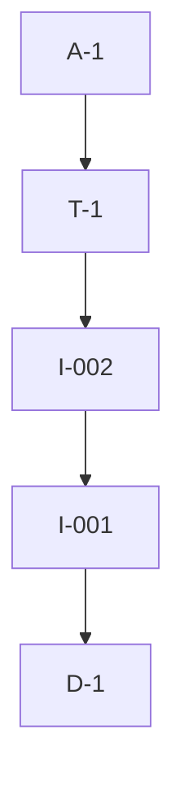

# Pipeline Plan

## Trigger
- Proposal: docs/versions/v0.1/modules/repo-governance/014-test-file-location-rule/proposal.md
- User launch confirmed: yes
- User launch statement: 确认，自动完成任务
- Launch stage: design
- First auto stage: implementation
- Design source: design.md
- Per-stage user confirmation: skipped by explicit user auto-pipeline authorization
- Auto-confirm completed document stages: automatic testing produces no testing Markdown; acceptance report is validated at completion
- Auto-pipeline document policy: stage-selective; manual design.md retained; no automatic testing Markdown; testplan.yaml required for automatic testing
- Version: v0.1
- Packet module: repo-governance
- Task name: 014-test-file-location-rule
- Target module(s): repo-governance
- change_id values: CHG-enforce-test-file-location

## Acceptance Baseline
- Final acceptance is judged against the launch-confirmed `proposal.md` and approved manual `design.md`.

## Stage Graph
| Task ID | Stage | Execution Mode | Responsibility | Scope | Parent Task | Depends On | Output | Done Condition |
|---------|-------|----------------|----------------|-------|-------------|------------|--------|----------------|
| D-1 | design | manual | approve the rule/index boundary and implementation order | bound task packet | root | none | approved `design.md` | design receipt exists and manual design checks pass |
| I-001 | implementation | auto-pipeline | create the authoritative independent-test-file placement rule | custom rule policy | root | D-1 | `test-file-location-rule.md` | rule states the complete approved directory contract without changing unrelated policy |
| I-002 | implementation | auto-pipeline | register the rule in the project custom-rule index | custom rule routing | root | I-001 | updated `harness/custom-rules/index.yaml` | root/module src and tests paths route in both modes and all governed execution stages |
| T-1 | testing | auto-pipeline | derive and implement task-scoped rule/index routing verification | CHG-enforce-test-file-location | root | I-002 | focused test, runner wiring, `testplan.yaml`, runtime evidence | task-scoped all run succeeds and covers the change id |
| A-1 | acceptance | auto-pipeline | independently falsify the rule, routing, documentation, and validation claims | complete delivery | root | T-1 | `acceptance-report.md` and final runtime state | report is accepted and all exit conditions pass |

## Submodule Tasks
| Task ID | Stage | Execution Mode | Responsibility | Submodule | Parent Task | Depends On | Output | Done Condition |
|---------|-------|----------------|----------------|-----------|-------------|------------|--------|----------------|

## Parallel Scheduling
- Strategy: dependency-ready-set
- Concurrency: use all runtime-available child-agent slots and immediately backfill available capacity.
- Shared artifact owner: parent-orchestrator
- Coordination: practical edit coordination avoids simultaneous mutation of shared files without treating paths as permissions.
- Lock directory: `.harness/locks/`
- Serialization reasons: explicit dependency, edit coordination, or exhausted concurrency capacity only.
- Evidence: record automatic task launches and reasons under `.harness/pipelines/v0.1/repo-governance/014-test-file-location-rule/state.json`; manual D-1 never appears in a wave.

## Dependency Graphs

| Level | Parent | Node | Depends On |
|-------|--------|------|------------|
| pipeline-task | root | D-1 | none |
| pipeline-task | root | I-001 | D-1 |
| pipeline-task | root | I-002 | I-001 |
| pipeline-task | root | T-1 | I-002 |
| pipeline-task | root | A-1 | T-1 |

## Exported Interfaces
| Interface | Owner | Consumer | Compatibility | Affected Callers | Migration Path |
|-----------|-------|----------|---------------|------------------|----------------|
| `project-test-file-location` custom-rule index entry | repo-governance | `harness/scripts/context.py` and governed agents | backward-compatible | existing custom-rule routing | none |

## API and Build Surface Impact
- Public API impact: none
- Crate-root export change: no
- Build-surface change: no
- Documentation examples affected: no

## Consumer Migration Closure
| Old Symbol | New Path | change_id | Consumer Path | Consumer Kind | Migration Status |
|------------|----------|-----------|---------------|---------------|------------------|
| not-applicable | not-applicable | CHG-enforce-test-file-location | verified-none | not-applicable | verified-none |

## State Ownership
| State | Owner | Access Interface | Lifecycle | Failure Transitions |
|-------|-------|------------------|-----------|---------------------|
| pipeline execution state | parent orchestrator | `.harness/pipelines/v0.1/repo-governance/014-test-file-location-rule/state.json` | pending to running to complete | failed validation returns to its owning automatic task |

## Failure Flows
| Flow | Boundary | Failure | Handling |
|------|----------|---------|----------|
| custom-rule loading | `context.py` to custom-rule index and Markdown file | missing file, stale entry, or invalid index metadata | fail index validation and return to I-001 or I-002 according to ownership |
| test-file path routing | task context to custom-rule matcher | root-level or module-level path fails to select the rule | fail focused routing verification and return to T-1 or I-002 if metadata is defective |

## Rejected Alternatives
| Decision Type | Selected | Rejected | Reason |
|---------------|----------|----------|--------|
| boundary | project-owned custom rule plus index entry | editing generated testing rules | the requested repository-specific constraint must survive generated-rule refreshes |
| technical | existing trigger/path routing | new repository-wide scanner | the approved scope asks for a Harness rule and focused routing evidence, not new scanning tooling |
| collaboration | sequential rule then index integration with parent-owned test registration | concurrent edits to the shared custom-rule index and runner | the file dependency is explicit and the task is too small to benefit from conflicting parallel writes |

## Implementation Scope Bindings
| change_id | target_module | proposal_id | design_coverage | scope_paths | design_rules_applied |
|-----------|---------------|-------------|-----------------|-------------|----------------------|
| CHG-enforce-test-file-location | repo-governance | P-001 | approved manual `design.md` rule contract, routing interface, and file sequence | `harness/custom-rules/test-file-location-rule.md`, `harness/custom-rules/index.yaml` | manual design decomposition, compatibility, failure flow, strict directory boundary |

## File-Level Implementation Sequence
The authoritative file-level sequence is in the approved manual `design.md`; its `implementation_task` values bind to I-001 and I-002 above.

## Return Rules
- Proposal ambiguity or an incorrect acceptance boundary stops the pipeline for user decision.
- A rule-text or index-routing defect returns to I-001 or I-002.
- Missing, weak, or non-runnable task evidence returns to T-1.
- A stale manual design returns to Design only when delivered behavior still satisfies the Proposal.
- The same unresolved issue stops after more than five unsuccessful return iterations.

## Exit Conditions
- Proposal outcomes satisfied.
- Required task-scoped evidence exists for CHG-enforce-test-file-location.
- Stage scope checks pass.
- Final acceptance report is accepted.
