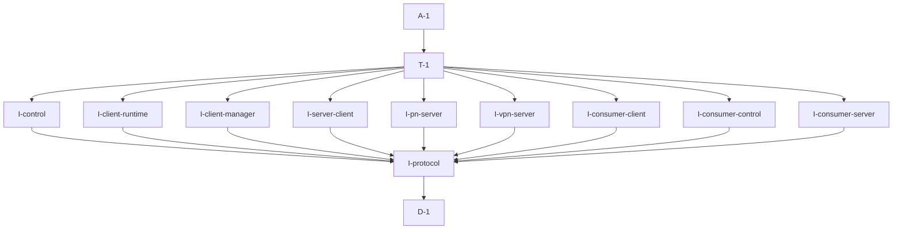

# Pipeline Plan

Risk profile: ./risk-profile.yaml

## Trigger
- Proposal: docs/versions/v0.1/modules/vpn-frame/007-fix-sfo-cmd-server-0-4-compile/proposal.md
- User launch confirmed: yes
- User launch statement: 确认，自动完成后续任务
- Launch stage: proposal
- First auto stage: design
- Design source: pipeline/plan.md
- Per-stage user confirmation: skipped by explicit user auto-pipeline authorization
- Auto-confirm completed document stages: no design/testing Markdown documents generated; acceptance report is validated at completion
- Auto-pipeline document policy: stage-selective; no automatic design/testing Markdown; testplan.yaml required for automatic testing
- Version: v0.1
- Packet module: vpn-frame
- Task name: 007-fix-sfo-cmd-server-0-4-compile
- Target module(s): vpn-frame
- change_id values: CHG-sfo-cmd-server-0-4-api-migration

## Acceptance Baseline
- Final acceptance is judged against the launch-confirmed `proposal.md` and this automatic-design mapping.

## Stage Graph
| Task ID | Stage | Execution Mode | Responsibility | Scope | Parent Task | Depends On | Output | Done Condition |
|---------|-------|----------------|----------------|-------|-------------|------------|--------|----------------|
| D-1 | design | auto-pipeline | map the sfo-cmd-server 0.4 package-length API to a wire-compatible vpn-frame type migration | bound task packet | root | none | complete pipeline-plan design mappings and risk checks | design structure and scope bindings pass without a design.md |
| I-protocol | implementation | auto-pipeline | define the shared wire-compatible package-length alias and migrate the command header alias | vpn-frame protocol source | root | D-1 | migrated vpn_protocol.rs | shared framing type compiles and preserves the existing wire width and limit |
| I-control | implementation | auto-pipeline | migrate the control-channel client bound | vpn-frame control adapter | root | I-protocol | migrated control_channel.rs | control adapter uses the shared package-length alias |
| I-client-runtime | implementation | auto-pipeline | migrate VPN client runtime bounds | vpn-frame client runtime | root | I-protocol | migrated vpn_client.rs | client runtime uses the shared package-length alias |
| I-client-manager | implementation | auto-pipeline | migrate VPN client manager bounds | vpn-frame client manager | root | I-protocol | migrated vpn_client_manager.rs | client manager uses the shared package-length alias |
| I-server-client | implementation | auto-pipeline | migrate the server-command client bounds | vpn-frame request/response client | root | I-protocol | migrated vpn_server_client.rs | request/response client uses the shared package-length alias |
| I-pn-server | implementation | auto-pipeline | migrate PN command server bounds and test service | vpn-frame PN control server | root | I-protocol | migrated pn_control_server.rs | production and existing test service use the shared package-length alias |
| I-vpn-server | implementation | auto-pipeline | migrate VPN command server bounds | vpn-frame VPN command server | root | I-protocol | migrated vpn_server.rs | VPN server handlers use the shared package-length alias |
| I-consumer-client | implementation | auto-pipeline | migrate vpn-client concrete command transport aliases exposed by workspace compile closure | vpn-client command consumer | root | I-protocol | migrated p2p_vpn.rs | concrete client send and guard aliases use VpnCmdPkgLen |
| I-consumer-control | implementation | auto-pipeline | migrate vpn-server PN control client and service aliases exposed by workspace compile closure | vpn-server PN control consumer | root | I-protocol | migrated pn_control_client.rs and pn_control_server.rs | concrete control client/server aliases use VpnCmdPkgLen |
| I-consumer-server | implementation | auto-pipeline | migrate vpn-server's delegated command server implementation exposed by workspace compile closure | vpn-server SN adapter | root | I-protocol | migrated sqlite_store_factory.rs | delegated server trait and handler use VpnCmdPkgLen |
| T-1 | testing | auto-pipeline | derive and execute task-scoped red-green compile and regression verification | migrated vpn-frame code and workspace consumers | root | I-control, I-client-runtime, I-client-manager, I-server-client, I-pn-server, I-vpn-server, I-consumer-client, I-consumer-control, I-consumer-server | testplan.yaml, runtime coverage, and test-run artifact | every risk check and change id has passing task-scoped evidence or a concrete gap |
| A-1 | acceptance | auto-pipeline | review requirement, design, implementation, and evidence consistency and close or return defects | complete delivery | root | T-1 | acceptance-report.md and final runtime state | report is accepted and pipeline exit checks pass |

## Submodule Tasks
| Task ID | Stage | Execution Mode | Responsibility | Submodule | Parent Task | Depends On | Output | Done Condition |
|---------|-------|----------------|----------------|-----------|-------------|------------|--------|----------------|

No direct submodule task is created: the affected protocol, client, and server files all consume one compile-time package-length contract, and splitting the same generic substitution across concurrent owners would create inconsistent intermediate types without an independent business boundary.

## Parallel Scheduling
- Strategy: dependency-ready-set
- Concurrency: use all runtime-available child-agent slots and immediately backfill available capacity.
- Shared artifact owner: parent-orchestrator
- Coordination: practical edit coordination serializes each automatic stage by explicit dependency because the single type migration has no independent submodule branch, without treating paths as permissions.
- Lock directory: `.harness/locks/`
- Serialization reasons: explicit dependency, edit coordination, or exhausted concurrency capacity only.
- Evidence: record automatic task launches and reasons under `.harness/pipelines/v0.1/vpn-frame/007-fix-sfo-cmd-server-0-4-compile/state.json`.

## Dependency Graphs

Arrows point from each dependent task to its prerequisite so the diagram matches the machine-checkable `Node` / `Depends On` rows below.

| Level | Parent | Node | Depends On |
|-------|--------|------|------------|
| pipeline-task | root | D-1 | none |
| pipeline-task | root | I-protocol | D-1 |
| pipeline-task | root | I-control | I-protocol |
| pipeline-task | root | I-client-runtime | I-protocol |
| pipeline-task | root | I-client-manager | I-protocol |
| pipeline-task | root | I-server-client | I-protocol |
| pipeline-task | root | I-pn-server | I-protocol |
| pipeline-task | root | I-vpn-server | I-protocol |
| pipeline-task | root | I-consumer-client | I-protocol |
| pipeline-task | root | I-consumer-control | I-protocol |
| pipeline-task | root | I-consumer-server | I-protocol |
| pipeline-task | root | T-1 | I-control, I-client-runtime, I-client-manager, I-server-client, I-pn-server, I-vpn-server, I-consumer-client, I-consumer-control, I-consumer-server |
| pipeline-task | root | A-1 | T-1 |

## Exported Interfaces
| Interface | Owner | Consumer | Compatibility | Affected Callers | Migration Path |
|-----------|-------|----------|---------------|------------------|----------------|
| `VpnCmdPkgLen` alias and `VpnCmdHeader` alias | vpn-frame protocol | vpn-frame control, client, server, and downstream crate consumers | migration-required | `vpn-frame/src/control_channel.rs`, client command adapters, server command handlers, `vpn-client`, `vpn-server` | define `VpnCmdPkgLen` as `sfo_cmd_server::U16`, use it in `VpnCmdHeader` and all command generics, and retain ordinary payload `u16` fields unchanged |

## API and Build Surface Impact
- Public API impact: migration-required
- Crate-root export change: yes
- Build-surface change: yes
- Documentation examples affected: no
- Impact detail: `VpnCmdPkgLen` becomes available through the existing `pub use vpn_protocol::*` export, and `sfo-cmd-server 0.4.0` requires a `CmdPkgLen` implementation instead of raw `u16`; no repository documentation example constructs the changed generic types.

## Consumer Migration Closure
| Old Symbol | New Path | change_id | Consumer Path | Consumer Kind | Migration Status |
|------------|----------|-----------|---------------|---------------|------------------|
| raw `u16` CmdHeader length parameter | `VpnCmdPkgLen` CmdHeader length parameter | CHG-sfo-cmd-server-0-4-api-migration | vpn-frame/src/vpn_protocol.rs | public protocol alias owner | migrated |
| raw `u16` CmdClient length parameter | `VpnCmdPkgLen` CmdClient length parameter | CHG-sfo-cmd-server-0-4-api-migration | vpn-frame/src/control_channel.rs | control adapter | migrated |
| raw `u16` CmdClient length parameter | `VpnCmdPkgLen` CmdClient length parameter | CHG-sfo-cmd-server-0-4-api-migration | vpn-frame/src/client/vpn_client.rs | client runtime | migrated |
| raw `u16` CmdClient length parameter | `VpnCmdPkgLen` CmdClient length parameter | CHG-sfo-cmd-server-0-4-api-migration | vpn-frame/src/client/vpn_client_manager.rs | client manager | migrated |
| raw `u16` CmdClient length parameter | `VpnCmdPkgLen` CmdClient length parameter | CHG-sfo-cmd-server-0-4-api-migration | vpn-frame/src/client/vpn_server_client.rs | server-command client | migrated |
| raw `u16` CmdServer length parameter | `VpnCmdPkgLen` CmdServer length parameter | CHG-sfo-cmd-server-0-4-api-migration | vpn-frame/src/server/pn_control_server.rs | PN control server and test service | migrated |
| raw `u16` CmdServer length parameter | `VpnCmdPkgLen` CmdServer length parameter | CHG-sfo-cmd-server-0-4-api-migration | vpn-frame/src/server/vpn_server.rs | VPN command server | migrated |
| raw `u16` classified command length parameter | `VpnCmdPkgLen` classified command length parameter | CHG-sfo-cmd-server-0-4-api-migration | vpn-client/src/p2p_vpn.rs | workspace client consumer | migrated |
| raw `u16` control command length parameter | `VpnCmdPkgLen` control command length parameter | CHG-sfo-cmd-server-0-4-api-migration | vpn-server/src/pn_control_client.rs | workspace server control client | migrated |
| raw `u16` command service length parameter | `VpnCmdPkgLen` command service length parameter | CHG-sfo-cmd-server-0-4-api-migration | vpn-server/src/pn_control_server.rs | workspace server control service | migrated |
| raw `u16` delegated CmdServer length parameter | `VpnCmdPkgLen` delegated CmdServer length parameter | CHG-sfo-cmd-server-0-4-api-migration | vpn-server/src/sqlite_store_factory.rs | workspace server adapter | migrated |

## State Ownership
| State | Owner | Access Interface | Lifecycle | Failure Transitions |
|-------|-------|------------------|-----------|---------------------|
| command package-length type selection | `vpn_protocol` | `VpnCmdPkgLen` and `VpnCmdHeader` aliases | selected at compile time and reused by every command client/server generic | an inconsistent or unsupported type fails compilation; oversized frames retain the existing u16::MAX framing failure boundary |

## Failure Flows
| Flow | Boundary | Failure | Handling |
|------|----------|---------|----------|
| encode/decode command header | vpn-frame protocol to sfo-cmd-server framing | wrapper selection changes bytes or accepted range | use `U16`, whose RawEncode/RawDecode delegates to `u16` and whose effective maximum is capped at `u16::MAX`; verify existing unit tests and compile closure |
| compile client/server adapters | vpn-frame to sfo-cmd-server 0.4 API | any raw `u16` remains where `CmdPkgLen` is required | task-scoped locked compilation fails and returns to I-1 until every diagnostic is closed |
| compile downstream applications | vpn-frame public type to vpn-client/vpn-server consumers | inferred or explicit consumer type is stale | locked workspace consumer checks fail and return to I-1 without changing protocol behavior |

## Rejected Alternatives
| Decision Type | Selected | Rejected | Reason |
|---------------|----------|----------|--------|
| boundary | centralize the framing type in `vpn_protocol` and migrate direct consumers | scatter direct `sfo_cmd_server::U16` imports without a vpn-frame alias | a single owner prevents client/server framing type drift and gives downstream code one stable domain name |
| technical | use `sfo_cmd_server::U16` with its default effective `u16::MAX` cap | revert to sfo-cmd-server 0.3.2 or introduce a local CmdPkgLen implementation | rollback rejects the requested update, while a local wrapper duplicates the dependency's supported wire-compatible type |
| collaboration | migrate the protocol alias first, then use dependency-linked file tasks for disjoint client/server call sites | edit all files as one opaque task or start dependent files before the shared alias exists | explicit file tasks preserve ownership and enable safe parallelism only after the shared compile-time interface is established |

## Implementation Scope Bindings
| change_id | target_module | proposal_id | design_coverage | scope_paths | design_rules_applied |
|-----------|---------------|-------------|-----------------|-------------|----------------------|
| CHG-sfo-cmd-server-0-4-api-migration | vpn-frame | P-001 | introduce one wire-compatible package-length alias, migrate every command client/server/header generic, retain the 0.4 dependency, and compile all workspace consumers | `vpn-frame/Cargo.toml`, `Cargo.lock`, `vpn-frame/src/vpn_protocol.rs`, `vpn-frame/src/control_channel.rs`, `vpn-frame/src/client/vpn_client.rs`, `vpn-frame/src/client/vpn_client_manager.rs`, `vpn-frame/src/client/vpn_server_client.rs`, `vpn-frame/src/server/pn_control_server.rs`, `vpn-frame/src/server/vpn_server.rs`, `vpn-client/src/p2p_vpn.rs`, `vpn-server/src/pn_control_client.rs`, `vpn-server/src/pn_control_server.rs`, `vpn-server/src/sqlite_store_factory.rs` | dependency mapping, explicit consumer migration, single state owner, failure flows, rejected alternatives, file dependency order |

## File-Level Implementation Sequence
| Sequence | Task ID | File-Level Module | Action | Depends On | change_id | target_module | Scope Paths | Context Sources |
|----------|---------|-------------------|--------|------------|-----------|---------------|-------------|-----------------|
| 1 | I-protocol | `vpn-frame/src/vpn_protocol.rs` | define VpnCmdPkgLen and migrate VpnCmdHeader after verifying the locked 0.4.0 dependency | none | CHG-sfo-cmd-server-0-4-api-migration | vpn-frame | `vpn-frame/src/vpn_protocol.rs` | proposal P-001, Cargo.toml, Cargo.lock, sfo-cmd-server 0.4 CmdPkgLen/U16 definitions |
| 2 | I-control | `vpn-frame/src/control_channel.rs` | migrate the control client trait bound | I-protocol | CHG-sfo-cmd-server-0-4-api-migration | vpn-frame | `vpn-frame/src/control_channel.rs` | VpnCmdPkgLen alias and existing control adapter |
| 3 | I-client-runtime | `vpn-frame/src/client/vpn_client.rs` | migrate client runtime trait bounds | I-protocol | CHG-sfo-cmd-server-0-4-api-migration | vpn-frame | `vpn-frame/src/client/vpn_client.rs` | VpnCmdPkgLen alias and existing client runtime |
| 4 | I-client-manager | `vpn-frame/src/client/vpn_client_manager.rs` | migrate client manager trait bounds | I-protocol | CHG-sfo-cmd-server-0-4-api-migration | vpn-frame | `vpn-frame/src/client/vpn_client_manager.rs` | VpnCmdPkgLen alias and existing client manager |
| 5 | I-server-client | `vpn-frame/src/client/vpn_server_client.rs` | migrate server-command client trait bounds | I-protocol | CHG-sfo-cmd-server-0-4-api-migration | vpn-frame | `vpn-frame/src/client/vpn_server_client.rs` | VpnCmdPkgLen alias and existing request/response methods |
| 6 | I-pn-server | `vpn-frame/src/server/pn_control_server.rs` | migrate server bounds and existing test service type | I-protocol | CHG-sfo-cmd-server-0-4-api-migration | vpn-frame | `vpn-frame/src/server/pn_control_server.rs` | VpnCmdPkgLen alias, command handlers, existing test module |
| 7 | I-vpn-server | `vpn-frame/src/server/vpn_server.rs` | migrate VPN command server bounds | I-protocol | CHG-sfo-cmd-server-0-4-api-migration | vpn-frame | `vpn-frame/src/server/vpn_server.rs` | VpnCmdPkgLen alias and existing command handlers |
| 8 | I-consumer-client | `vpn-client/src/p2p_vpn.rs` | migrate concrete classified command send and guard aliases found by workspace compile closure | I-protocol | CHG-sfo-cmd-server-0-4-api-migration | vpn-frame | `vpn-client/src/p2p_vpn.rs` | proposal boundary for proven consumer edits, VpnCmdPkgLen alias, failed workspace artifact |
| 9 | I-consumer-control | `vpn-server/src/pn_control_client.rs`, `vpn-server/src/pn_control_server.rs` | migrate concrete PN control client and service aliases found by workspace compile closure | I-protocol | CHG-sfo-cmd-server-0-4-api-migration | vpn-frame | `vpn-server/src/pn_control_client.rs`, `vpn-server/src/pn_control_server.rs` | proposal boundary for proven consumer edits, VpnCmdPkgLen alias, failed workspace artifact |
| 10 | I-consumer-server | `vpn-server/src/sqlite_store_factory.rs` | migrate the delegated CmdServer implementation and handler generic found by workspace compile closure | I-protocol | CHG-sfo-cmd-server-0-4-api-migration | vpn-frame | `vpn-server/src/sqlite_store_factory.rs` | proposal boundary for proven consumer edits, VpnCmdPkgLen alias, failed workspace artifact |

## Return Rules
- Proposal ambiguity or an incorrect acceptance boundary stops the pipeline for user decision.
- An incorrect framing compatibility mapping returns to D-1 when the design is wrong, or I-1 when adequate design exists but code is defective.
- Remaining compile errors, changed wire behavior, or stale consumers return to the owning implementation task.
- Missing task-scoped red-green or regression evidence returns to T-1.
- The same unresolved issue stops after more than five unsuccessful return iterations.

## Exit Conditions
- `sfo-cmd-server 0.4.0` remains selected in the locked dependency graph.
- All command framing generics use the shared `VpnCmdPkgLen` type and no raw `u16` remains in a `CmdHeader`, `CmdClient`, `CmdServer`, or command-server test-service package-length position.
- The task-scoped vpn-frame unit check and locked compile closure for vpn-frame, vpn-client, and vpn-server pass.
- Required task-scoped evidence covers CHG-sfo-cmd-server-0-4-api-migration and the captured 43-error regression.
- Final acceptance report is accepted with no blocking findings.
