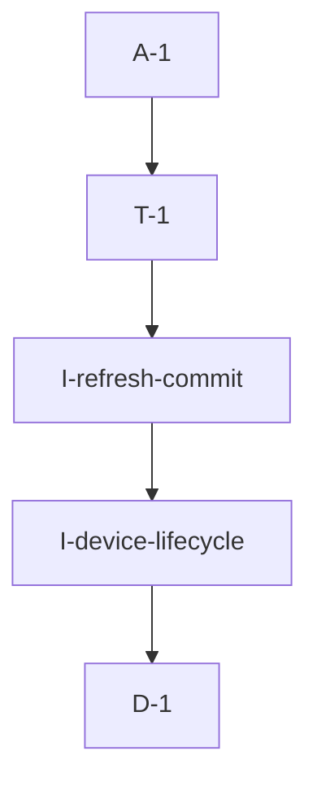

# Pipeline Plan

Risk profile: ./risk-profile.yaml

## Trigger
- Proposal: docs/versions/v0.1/modules/vpn-frame/011-preserve-tun-on-server-recovery/proposal.md
- User launch confirmed: yes
- User launch statement: 确认，自动完成任务
- Launch stage: proposal
- First auto stage: design
- Design source: pipeline/plan.md
- Per-stage user confirmation: skipped by explicit user auto-pipeline authorization
- Auto-confirm completed document stages: no design/testing Markdown documents generated; acceptance report is validated at completion
- Auto-pipeline document policy: stage-selective; no automatic design/testing Markdown; testplan.yaml required for automatic testing
- Version: v0.1
- Packet module: vpn-frame
- Task name: 011-preserve-tun-on-server-recovery
- Target module(s): vpn-frame
- change_id values: CHG-preserve-tun-on-control-refresh, CHG-retry-failed-tun-update

## Acceptance Baseline
- Final acceptance is judged against the launch-confirmed `proposal.md` and this automatic-design mapping.

## Stage Graph
| Task ID | Stage | Execution Mode | Responsibility | Scope | Parent Task | Depends On | Output | Done Condition |
|---------|-------|----------------|----------------|-------|-------------|------------|--------|----------------|
| D-1 | design | auto-pipeline | map TUN-effective, receive-context, routing-only, failure, retry, and multi-network consistency boundaries | bound vpn-frame task packet | root | none | complete pipeline-plan mappings and risk checks | plan, scope bindings, state ownership, and risk profile validate without design.md |
| I-device-lifecycle | implementation | auto-pipeline | reconcile device metadata, receive context, and OS TUN lifecycle without PN-only recreation | vpn-frame device lifecycle | root | D-1 | updated vpn_device.rs | routing-only changes preserve the device; failed real updates keep retryable managed state and return the underlying error |
| I-refresh-commit | implementation | auto-pipeline | reconcile every returned network without losing map entries and commit versions only after complete success | vpn-frame VPN-info refresh | root | I-device-lifecycle | updated vpn_client.rs | any network failure restores the managed map, returns failure, and leaves both versions uncommitted |
| T-1 | testing | auto-pipeline | derive and run task-scoped classification, lifecycle, retry, multi-network, and compile verification | delivered vpn-frame client code | root | I-refresh-commit | testplan.yaml, dedicated tests, runtime coverage, and test-run artifact | both change ids and required risk checks have passing evidence or a concrete platform gap |
| A-1 | acceptance | auto-pipeline | review proposal, plan, implementation, tests, and platform limitations and close or return defects | complete delivery | root | T-1 | acceptance-report.md and final runtime state | report is accepted and pipeline exit checks pass |

## Submodule Tasks
| Task ID | Stage | Execution Mode | Responsibility | Submodule | Parent Task | Depends On | Output | Done Condition |
|---------|-------|----------------|----------------|-----------|-------------|------------|--------|----------------|

No deeper submodule tasks are created. `vpn_device.rs` owns the OS-resource lifecycle and `vpn_client.rs` owns refresh/version consistency; those file-level ownership boundaries are already represented as dependent implementation tasks, so another nesting layer would duplicate ownership.

## Parallel Scheduling
- Strategy: dependency-ready-set
- Concurrency: use runtime-available child-agent slots when dependencies permit.
- Shared artifact owner: parent-orchestrator
- Coordination: practical edit coordination serializes implementation because refresh consistency consumes the device-lifecycle interface; at every scheduling point the parent uses available capacity for dependency-ready work.
- Lock directory: `.harness/locks/`
- Serialization reasons: explicit dependency, edit coordination, or exhausted concurrency capacity only.
- Evidence: automatic task launches are recorded under `.harness/pipelines/v0.1/vpn-frame/011-preserve-tun-on-server-recovery/state.json`.

## Dependency Graphs


Arrows point from each dependent task to its prerequisite.

| Level | Parent | Node | Depends On |
|-------|--------|------|------------|
| pipeline-task | root | D-1 | none |
| pipeline-task | root | I-device-lifecycle | D-1 |
| pipeline-task | root | I-refresh-commit | I-device-lifecycle |
| pipeline-task | root | T-1 | I-refresh-commit |
| pipeline-task | root | A-1 | T-1 |

## Exported Interfaces
| Interface | Owner | Consumer | Compatibility | Affected Callers | Migration Path |
|-----------|-------|----------|---------------|------------------|----------------|
| existing `VpnDevice::start` and `VpnDevice::update_device` public methods | vpn-frame client device lifecycle | existing Rust consumers | backward-compatible | none | retain signatures and behavior for direct consumers while delegating production reconciliation to compatible internal helpers |
| crate-internal device reconciliation with a refreshed receive context | vpn-frame client device lifecycle | `vpn-frame/src/client/vpn_client.rs` / both change ids | new | none | VPN-info refresh supplies the current network snapshot and current `DevicePkgRecv` while public methods remain available |

## File-Level Interfaces
```rust
impl<S: PacketRecv> VpnDevice<S> {
    pub fn start(&mut self, recv: Arc<S>) -> VpnResult<()>;
    pub fn update_device(&mut self, network: NodeNetwork) -> VpnResult<()>;
    pub(crate) fn reconcile(&mut self, network: NodeNetwork, recv: Arc<S>) -> VpnResult<()>;
}

impl<...> VpnClient<...> {
    async fn run_proc(self: &Arc<Self>) -> VpnResult<()>;
    fn reconcile_vpn_devices(
        &self,
        vpn_infos: Vec<NodeVpnInfo>,
    ) -> VpnResult<()>;
}
```

The concrete consumer is the existing `VpnClient::run_proc`. The crate-internal interface is new and non-breaking; the existing public methods remain source-compatible.

## API and Build Surface Impact
- Public API impact: backward-compatible
- Crate-root export change: no
- Build-surface change: no
- Documentation examples affected: no
- Impact detail: no VPN command, serialized type, public field, dependency, Cargo feature, or exported module is changed. Existing public device methods retain their signatures; only crate-internal reconciliation is added.

## State Ownership
| State | Owner | Access Interface | Lifecycle | Failure Transitions |
|-------|-------|------------------|-----------|---------------------|
| OS TUN handle, read task, current network snapshot, and receive context | `VpnDevice` | start/update plus crate-internal reconcile | created on first successful configuration, retained across routing-only refresh, read-task-only refresh for dispatch changes, recreated only for TUN-effective changes, dropped with the managed device | create/recreate failure keeps the device object and receive context managed with no live handle, returns the underlying error, and permits the next full refresh to retry |
| network-id to managed device map | `VpnClient` | refresh reconciliation and incoming packet lookup | temporarily moved into one refresh transaction, every removed entry is reinserted before success/failure return, stale entries are removed only after the full response applies | any per-network failure restores the complete managed map; already successful entries remain idempotently applied and the failed entry remains retryable |
| applied VPN-info and PN-info versions | `VpnClient` atomics | `run_proc` request and final commit | read before polling and advanced together only after PN routing plus all device reconciliation succeeds | any routing/device/conversion failure leaves both versions unchanged so the server returns a retryable full update on the next poll |
| PN routes and peer-member routes | tunnel factory and tunnel router | `on_vpn_info_received` and `add_network` | updated from each returned VPN-info response without owning the OS TUN | temporary PN connection failure returns before device mutation; later device failure leaves versions uncommitted and the next poll reapplies routing idempotently |

## Change Classification
| Field or Input | Classification | Required Action |
|----------------|----------------|-----------------|
| `NodeNetwork.id`, `ip`, `mask`, `ipv6`, `ipv6_mask` | TUN-effective | recreate or recover the OS device and refresh the read task; failure is returned and remains retryable |
| `NodeNetwork.group_id` | receive-dispatch-effective | retain the OS TUN, replace the read task/context so outbound packets use the current group |
| `NodeNetwork.name`, `NodeNetwork.pn_server` | control/routing metadata | update the stored snapshot/router without destroying the TUN |
| `NodeVpnInfo.members` | peer-routing metadata | update tunnel router membership without changing the TUN |

For an existing map entry the network ID is expected to match its key; a mismatch is treated as TUN-effective defensive reconciliation rather than silently rekeying the entry.

## Key Call Flows
```mermaid
sequenceDiagram
  participant Poll as VpnClient::run_proc
  participant Server as VpnServerClient
  participant Routes as TunnelFactory/Router
  participant Devices as Device Map
  participant Tun as VpnDevice

  Poll->>Server: GetVpnInfo(applied versions)
  Server-->>Poll: versions and network snapshots
  Poll->>Routes: apply PN routes
  Poll->>Devices: take managed map for reconciliation
  loop each returned network
    Poll->>Tun: reconcile(snapshot, receive context)
    alt routing-only metadata
      Tun-->>Poll: success without OS handle replacement
    else receive context changed
      Tun-->>Poll: same OS handle with refreshed read task
    else TUN-effective change
      Tun-->>Poll: recreate success or explicit error
    end
    Poll->>Devices: reinsert managed entry before continuing
  end
  alt every network succeeded
    Poll->>Routes: apply member routes
    Poll->>Poll: commit both versions
  else any network failed
    Poll->>Devices: restore complete managed map
    Poll-->>Poll: return error; retain old versions for next-poll retry
  end
```

## Failure Flows
| Flow | Boundary | Failure | Handling |
|------|----------|---------|----------|
| PN routing preparation | `on_vpn_info_received` before device-map transaction | PN connection or route decode error | return without touching the device map or versions; next poll retries |
| existing TUN receives PN-only metadata | VPN-info snapshot to device reconciliation | PN endpoint/name changes after server restart | update stored metadata and router only; keep OS handle and read task |
| actual TUN-effective update | VpnDevice to tun-rs/Wintun | adapter recreation fails or prior adapter cleanup is delayed | retain managed entry and receive context, log network ID plus underlying error, return failure, do not commit versions, retry next poll |
| one network fails after earlier networks succeeded | VpnClient multi-network reconciliation | partial application | reinsert every processed/unprocessed device; retain all entries, skip stale-entry removal and both version commits; next full response is idempotently reapplied |
| response omits a formerly configured network | successful full reconciliation | network removed by server | remove/drop the stale entry only after all returned entries apply successfully |

## Invariants to Preserve
- A PN-only or member-only refresh never drops or recreates an existing OS TUN.
- No device removed from the map for processing is lost on an error path.
- Both applied versions advance together only after the complete response is applied.
- A failed device remains retryable even when its desired network snapshot already matches the next response.
- Existing VPN wire, SN/PN authorization, tunnel routing, adapter naming, MTU, and packet filtering behavior remain unchanged.

## Rejected Alternatives
| Decision Type | Selected | Rejected | Reason |
|---------------|----------|----------|--------|
| boundary | classify fields and keep routing-only refresh outside OS TUN lifecycle | delay every unconditional TUN recreation | a delay does not remove the incorrect PN-to-OS-resource coupling and still permits permanent loss |
| technical | return the underlying error, retain managed state, and retry via unchanged versions | log and continue while advancing versions | advancing versions makes the failed device invisible to later unchanged polls, which is the observed permanent-loss defect |
| technical | reinsert entries immediately and commit versions only after all succeed | clear the global map and insert only successful devices | the current approach drops failed and not-yet-processed devices and cannot recover deterministically |
| boundary | add a crate-internal reconciliation path and retain existing public signatures | change or remove the public `VpnDevice` methods | no public API change is needed to satisfy the runtime fix |
| technical | isolate deterministic classification/reconciliation logic in dedicated test files | require privileged real-TUN creation for every test | real TUN creation is platform/privilege dependent and cannot provide portable failure injection; Windows coverage remains an explicit execution gap |
| collaboration | implement device lifecycle before client refresh consistency, then test the integrated result | edit both dependent files concurrently | the refresh transaction consumes the device reconciliation contract, so serial implementation avoids conflicting assumptions while preserving one owner per output |

## Implementation Scope Bindings
| change_id | target_module | proposal_id | design_coverage | scope_paths | design_rules_applied |
|-----------|---------------|-------------|-----------------|-------------|----------------------|
| CHG-preserve-tun-on-control-refresh | vpn-frame | P-001 | classify network changes, retain the OS handle for PN/name/member changes, refresh receive context without TUN replacement, and keep router application separate | `vpn-frame/src/client/vpn_device.rs`, `vpn-frame/src/client/vpn_client.rs` | lifecycle ownership, runtime failure flow, backward-compatible internal interface, field classification, cross-boundary sequence |
| CHG-retry-failed-tun-update | vpn-frame | P-002 | retain every managed map entry, surface device errors, make failed desired state retryable, and condition both version stores on complete success | `vpn-frame/src/client/vpn_device.rs`, `vpn-frame/src/client/vpn_client.rs` | partial-completion model, state owner, retry ordering, multi-network invariant, rollback boundary |

## File-Level Implementation Sequence
| Sequence | Task ID | File-Level Module | Action | Depends On | change_id | target_module | Scope Paths | Context Sources |
|----------|---------|-------------------|--------|------------|-----------|---------------|-------------|-----------------|
| 1 | I-device-lifecycle | `vpn-frame/src/client/vpn_device.rs` | separate TUN-effective and dispatch-effective changes, preserve PN-only TUN state, retain receive context on create failure, and expose compatible crate-internal reconciliation | none | CHG-preserve-tun-on-control-refresh | vpn-frame | `vpn-frame/src/client/vpn_device.rs` | proposal P-001/P-002, VpnDevice ownership, NodeNetwork fields, observed create/drop failure |
| 2 | I-refresh-commit | `vpn-frame/src/client/vpn_client.rs` | supply current receive context, reinsert devices on every path, remove stale entries only after full success, propagate errors, and commit both versions last | I-device-lifecycle | CHG-retry-failed-tun-update | vpn-frame | `vpn-frame/src/client/vpn_client.rs` | proposal P-001/P-002, device reconciliation interface, GetVpnInfo ordering, multi-network state model |

## Return Rules
- Proposal ambiguity or an incorrect acceptance boundary stops the pipeline for user decision.
- Incorrect field classification, ownership, compatibility, or partial-failure semantics returns to D-1.
- TUN recreation on PN-only change, lost map entries, swallowed errors, premature version commits, or compile failures return to the owning implementation task.
- Missing task-scoped lifecycle, retry, multi-network, or compile evidence returns to T-1.
- The same unresolved issue stops after more than five unsuccessful return iterations.

## Exit Conditions
- PN/name/member-only refresh preserves the live TUN and updates routing/metadata.
- Receive-dispatch changes refresh the reader without replacing the OS TUN.
- Actual interface update failure is logged and returned, the device remains managed, and the next poll retries because neither version advanced.
- Multi-network partial failure cannot lose processed or unprocessed device entries and stale removal occurs only on full success.
- Task-scoped focused tests and compile closure pass for both change ids; Windows/Wintun runtime limits are explicitly recorded.
- Final acceptance report is accepted with no blocking findings.
