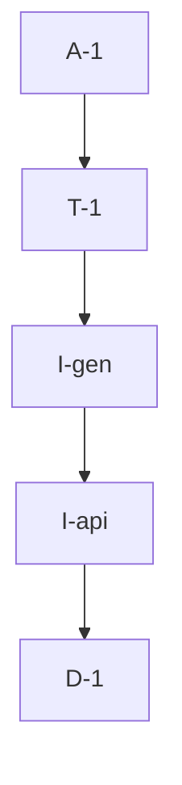

# Pipeline Plan

Risk profile: ./risk-profile.yaml

## Trigger
- Proposal: docs/versions/v0.1/modules/vpn_web/002-align-proxy-node-api/proposal.md
- User launch confirmed: yes
- User launch statement: 确认，自动完成任务
- Launch stage: proposal
- First auto stage: design
- Design source: pipeline/plan.md
- Per-stage user confirmation: skipped by explicit user auto-pipeline authorization
- Auto-confirm completed document stages: no design/testing Markdown documents generated; acceptance report is validated at completion
- Auto-pipeline document policy: stage-selective; no automatic design/testing Markdown; testplan.yaml required for automatic testing
- Version: v0.1
- Packet module: vpn_web
- Task name: 002-align-proxy-node-api
- Target module(s): vpn_web
- change_id values: CHG-align-proxy-node-api

## Acceptance Baseline
- Final acceptance is judged against the launch-confirmed `proposal.md` and this automatic-design mapping.

## Stage Graph
| Task ID | Stage | Execution Mode | Responsibility | Scope | Parent Task | Depends On | Output | Done Condition |
|---------|-------|----------------|----------------|-------|-------------|------------|--------|----------------|
| D-1 | design | auto-pipeline | map the current server contract to the smallest compatible frontend model change | bound task packet | root | none | complete pipeline-plan design mappings | design structure and scope bindings pass without a design.md |
| I-api | implementation | auto-pipeline | update annotated Dart API models while preserving the existing page-facing accessor | vpn_web API client source | root | D-1 | updated api.dart | source model matches JsonPnServerInfo and existing page consumer compiles conceptually |
| I-gen | implementation | auto-pipeline | regenerate JSON serialization glue from the updated annotations | generated Dart serializer | root | I-api | regenerated api.g.dart | build_runner output uses the current server keys and has no hand edits |
| T-1 | testing | auto-pipeline | derive and execute task-scoped frontend contract verification | corrected API model and generated serializer | root | I-gen | testplan.yaml, runtime coverage, and test-run artifact | every change id has task-scoped passing or reasoned manual evidence |
| A-1 | acceptance | auto-pipeline | review requirement and implementation consistency and close or return defects | complete delivery | root | T-1 | acceptance-report.md and final runtime state | report is accepted and pipeline exit checks pass |

## Submodule Tasks
| Task ID | Stage | Execution Mode | Responsibility | Submodule | Parent Task | Depends On | Output | Done Condition |
|---------|-------|----------------|----------------|-----------|-------------|------------|--------|----------------|

## Parallel Scheduling
- Strategy: dependency-ready-set
- Concurrency: use all runtime-available child-agent slots and immediately backfill available capacity.
- Shared artifact owner: parent-orchestrator
- Coordination: practical edit coordination avoids simultaneous mutation of generated and source API files without treating paths as permissions.
- Lock directory: `.harness/locks/`
- Serialization reasons: explicit dependency, edit coordination, or exhausted concurrency capacity only.
- Evidence: record automatic task launches and reasons under `.harness/pipelines/v0.1/vpn_web/002-align-proxy-node-api/state.json`.

## Dependency Graphs

| Level | Parent | Node | Depends On |
|-------|--------|------|------------|
| pipeline-task | root | D-1 | none |
| pipeline-task | root | I-api | D-1 |
| pipeline-task | root | I-gen | I-api |
| pipeline-task | root | T-1 | I-gen |
| pipeline-task | root | A-1 | T-1 |

## Exported Interfaces
| Interface | Owner | Consumer | Compatibility | Affected Callers | Migration Path |
|-----------|-------|----------|---------------|------------------|----------------|
| `PnServerInfo.fromJson` / `toJson` and `allAddresses` | vpn_web api-client | `ProxyNodesPage` and `Api._setProxyNodeApproval` | backward-compatible | existing vpn_web proxy-node consumers | none; page-facing accessor remains stable while the nested wire mapping is corrected |

## API and Build Surface Impact
- Public API impact: none
- Crate-root export change: no
- Build-surface change: no
- Documentation examples affected: no

## Consumer Migration Closure
| Old Symbol | New Path | change_id | Consumer Path | Consumer Kind | Migration Status |
|------------|----------|-----------|---------------|---------------|------------------|
| obsolete `PnServerInfo.ip/port/addresses` wire mapping | `PnServerInfo.name/endpoints/portMapping` wire mapping | CHG-align-proxy-node-api | vpn_web/lib/proxy_nodes_page.dart | frontend model consumer | migrated |

## State Ownership
| State | Owner | Access Interface | Lifecycle | Failure Transitions |
|-------|-------|------------------|-----------|---------------------|
| typed proxy-node response value | vpn_web api-client | `Api.getProxyNodes` typed list result | HTTP JSON response to typed model to ProxyNodesPage row rendering | transport/API envelope errors remain HttpResult failures; malformed contract data remains a parsing failure surfaced by the existing call path |

## Failure Flows
| Flow | Boundary | Failure | Handling |
|------|----------|---------|----------|
| list proxy nodes | vpn-server JSON response to vpn_web generated decoder | nested pn_server fields do not match the decoder | align decoder to the current server contract; existing page error behavior remains unchanged for transport/API failures |
| approve or reject proxy node | vpn_web generated encoder to vpn-server request decoder | frontend sends obsolete nested pn_server fields | generate the request mapping from the corrected model so the server receives id, name, endpoints, and port_mapping |

## Rejected Alternatives
| Decision Type | Selected | Rejected | Reason |
|---------------|----------|----------|--------|
| boundary | correct the vpn_web consumer only | change the server back to the obsolete shape | the server contract is current and shared; reverting it would expand impact beyond the reported frontend defect |
| technical | model the current fields directly and regenerate serialization | add a dual-shape compatibility decoder | backward support for an unrequested obsolete response would hide contract drift and add parsing branches |
| collaboration | serialize source-model update before generated-file regeneration | edit api.dart and api.g.dart concurrently | generated output depends mechanically on the final annotations and must remain tool-owned |

## Implementation Scope Bindings
| change_id | target_module | proposal_id | design_coverage | scope_paths | design_rules_applied |
|-----------|---------------|-------------|-----------------|-------------|----------------------|
| CHG-align-proxy-node-api | vpn_web | P-001 | replace the obsolete nested pn_server fields, preserve the page-facing endpoint accessor, and regenerate both decoder and encoder mappings | `vpn_web/lib/api.dart`, `vpn_web/lib/api.g.dart` | API boundary ownership, explicit consumer compatibility, failure flow, serialized implementation order |

## File-Level Implementation Sequence
| Sequence | Task ID | File-Level Module | Action | Depends On | change_id | target_module | Scope Paths | Context Sources |
|----------|---------|-------------------|--------|------------|-----------|---------------|-------------|-----------------|
| 1 | I-api | `vpn_web/lib/api.dart` | modify annotated PnServerInfo and supporting value types | none | CHG-align-proxy-node-api | vpn_web | `vpn_web/lib/api.dart` | proposal P-001, JsonPnServerInfo in vpn-server/src/api.rs, this plan's interface mapping |
| 2 | I-gen | `vpn_web/lib/api.g.dart` | regenerate with Dart build_runner | I-api | CHG-align-proxy-node-api | vpn_web | `vpn_web/lib/api.g.dart` | updated api.dart annotations and repository build_runner configuration |

## Return Rules
- Proposal ambiguity or an incorrect acceptance boundary stops the pipeline for user decision.
- An incorrect frontend/server mapping returns to D-1 when the mapping is wrong, or the relevant implementation task when adequate design exists but code is defective.
- Missing generated output or task evidence returns to I-gen or T-1 respectively.
- The same unresolved issue stops after more than five unsuccessful return iterations.

## Exit Conditions
- The current server proxy-node response parses through the generated frontend mapping.
- Approve/reject serialization uses the same current nested shape.
- Required task-scoped evidence covers CHG-align-proxy-node-api.
- Final acceptance report is accepted with no blocking findings.
