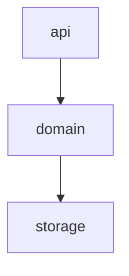

# Pipeline Plan

## Trigger
- Proposal: docs/versions/<version>/modules/<packet-module>/<task-name>/proposal.md
- User launch confirmed: <yes-after-explicit-user-launch>
- User launch statement: <verbatim-user-instruction-that-explicitly-launches-auto-pipeline>
- Per-stage user confirmation: skipped by explicit user auto-pipeline authorization
- Auto-confirm completed document stages: no design/testing Markdown documents generated; repository-local document extensions only
- Auto-pipeline document policy: no design/testing markdown docs; testplan.yaml required
- Version: <version>
- Packet module: <project-or-globals>
- Task name: <task-seq>-<task-slug>
- Target module(s): <project-module>[, <project-module>]
- change_id values: <change-id>[, <change-id>]

## Acceptance Baseline
- Final acceptance is judged against:
  - `proposal.md`

## Stage Graph
| Task ID | Stage | Status | Responsibility | Scope | Parent Task | Depends On | Output | Done Condition |
|---------|-------|--------|----------------|-------|-------------|------------|--------|----------------|
| D-1 | design | pending | convert user-confirmed intent into executable structure | bound task packet | root | none | pipeline-plan design mappings and scope bindings | design rules satisfied without generating design docs |
| I-1 | implementation | pending | deliver production code inside approved boundaries | bound task packet | root | D-1 | production code | implementation complete |
| T-1 | testing | pending | design test cases from proposal/pipeline-plan design/code, generate test implementation, and wire tests into unified entrypoint | bound task packet | root | I-1 | tests + testplan.yaml + test-run wiring + pipeline-plan testing evidence | testing implementation reachable through test-run |
| A-1 | acceptance | pending | generate acceptance rules and expected results, audit the evidence chain, and judge proposal satisfaction | bound task packet | root | T-1 | acceptance report | acceptance passed |

## Submodule Tasks
| Task ID | Stage | Status | Responsibility | Submodule | Parent Task | Depends On | Output | Done Condition |
|---------|-------|--------|----------------|-----------|-------------|------------|--------|----------------|
| I-file-1 | implementation | pending | implement one file-level module | <file-level-module> | I-1 | D-1 | production file | file implementation complete |

## Dependency Graphs

| Level | Parent | Node | Depends On |
|-------|--------|------|------------|
| submodule | <project-module> | api | domain |
| submodule | <project-module> | domain | storage |
| submodule | <project-module> | storage | none |

## Exported Interfaces
| Interface | Owner | Consumer | Compatibility | Affected Callers | Migration Path |
|-----------|-------|----------|---------------|------------------|----------------|
| <interface-name> | <owning-submodule> | <existing-module-or-change-id> | new | none | none |

## State Ownership
| State | Owner | Access Interface | Lifecycle | Failure Transitions |
|-------|-------|------------------|-----------|---------------------|
| <persistent-or-shared-state> | <single-owner-submodule> | <exported-interface> | <states-and-legal-transitions> | <failed-state-and-recovery-transitions> |

## Failure Flows
| Flow | Boundary | Failure | Handling |
|------|----------|---------|----------|
| <key-call-flow> | <cross-module-boundary> | <concrete-failure> | <propagation-retry-rollback-or-compensation> |

## Rejected Alternatives
| Decision Type | Selected | Rejected | Reason |
|---------------|----------|----------|--------|
| boundary | <selected-boundary> | <rejected-boundary> | <why-rejected> |
| technical | <selected-technology> | <rejected-technology> | <why-rejected> |
| collaboration | <selected-collaboration> | <rejected-collaboration> | <why-rejected> |

## Implementation Scope Bindings
| change_id | target_module | proposal_id | design_coverage | scope_paths | design_rules_applied |
|-----------|---------------|-------------|-----------------|-------------|----------------------|
| <change-id> | <project-module> | <proposal-id> | <concrete pipeline-plan design mapping> | `<repo-relative/path>` | module decomposition, dependencies, interfaces, state, risks |

## File-Level Implementation Sequence
| Sequence | Task ID | Status | File-Level Module | Action | Depends On | change_id | target_module | Scope Paths | Context Sources |
|----------|---------|--------|-------------------|--------|------------|-----------|---------------|-------------|-----------------|
| 1 | I-file-1 | pending | `<repo-relative/path>` | create / modify | none | <change-id> | <project-module> | `<repo-relative/path>` | proposal excerpt, pipeline-plan design mapping, relevant source only |

## Testing Evidence
| change_id | validation_id | testplan_level | testplan_step_id | evidence | gap | gap_manual_reason |
|-----------|---------------|----------------|------------------|----------|-----|-------------------|
| <change-id> | <validation-id> | unit | <testplan-step-id> | <test path or run artifact> | no | n/a |

## Testing Case-Type Coverage
| change_id | case_type | required | validation_id | level | status | gap_manual_reason |
|-----------|-----------|----------|---------------|-------|--------|-------------------|
| <change-id> | normal | yes | <validation-id> | unit | covered | n/a |

## Return Rules
- If acceptance finds proposal ambiguity:
  - stop the pipeline and ask the user to decide; do not infer the requirement or create an automatic proposal return task
- If acceptance finds design mismatch:
  - return to design when the architecture, algorithm, state/concurrency/resource model, interface contract, or failure strategy is absent or wrong
- If acceptance finds implementation defect:
  - return to implementation when adequate design exists but delivered code is defective
- If acceptance finds testing implementation gap:
  - return to testing task
- For non-requirement findings:
  - repeat design -> implementation -> testing, then rerun acceptance
- If the same unresolved issue remains after more than 5 unsuccessful iterations:
  - stop and report the issue to the user

## Exit Condition
- [ ] All blocking issues closed
- [ ] Required evidence exists
- [ ] Auto-pipeline generated no `design.md`, task-local `design/`, `testing.md`, or `testing/` artifacts, and generated required `testplan.yaml`
- [ ] Every implemented `change_id` has proposal/pipeline-plan design traceability and generated test coverage or an explicit test gap
- [ ] Every single-stage task passed stage-scope-check
- [ ] `uv run --active python ./harness/scripts/pipeline-plan-check.py harness/pipeline-plan.md --require-complete` passed
- [ ] Final acceptance passed against `proposal.md`
